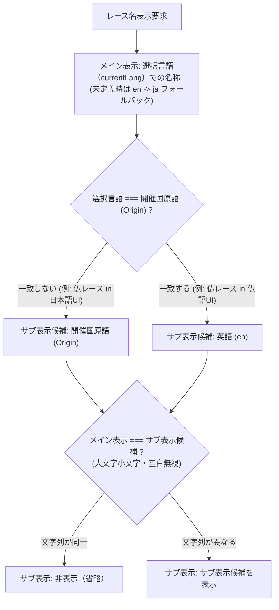

# 重賞カレンダーサービス プロダクト要求仕様書 (PRD)

| 項目 | 内容 |
| :--- | :--- |
| **プロダクト名** | horse-racing-calendar Web アプリケーション |
| **作成日** | 2026年9月12日 (最終更新: 2026年9月21日) |
| **バージョン** | v1.27.2 (モバイルフィルター操作ボタン文言短縮による横幅収容・見切れ解消) |
| **配信形式** | SPA / PWA (GitHub Pages ホスティング) |
| **公式テーマカラー** | `#047B5F` (Turf Green / エメラルドグリーン) |

---

## 1. プロジェクト概要

本プロダクト（`horse-racing-calendar`）は、JRA（日本中央競馬会）の重賞レース（G1, G2, G3, J.G1, J.G2, J.G3）に加え、NAR（地方競馬全国協会）のダートグレード競走（Jpn1〜Jpn3、国際G1）、南関東重賞（S1〜S3）、全国各地区の地方重賞、ばんえい競馬（重賞）、フランス競馬（France-Galop / IFHA Part I 重賞: G1, G2, G3）、そして海外競馬第2弾としての **イギリス競馬（British Horseracing Authority: BHA / IFHA Part I 重賞: G1, G2, G3）** を包括的に統合し、国内外の主要競馬年間・月間スケジュールを一元的に視覚的かつ軽快に確認できるモダンなWebアプリケーションである。

モバイル閲覧時は直近レースを素早く確認できる **「タイムライン形式」**、PC/タブレット閲覧時は月全体のスケジュールを鳥瞰できる **「月間カレンダー形式」** を初期表示とし、PWA（Progressive Web Apps）およびオフライン閲覧に対応することで、競馬場や外出先などの電波状況が不安定な環境でもミリ秒単位でストレスなくアクセスできる体験を提供する。

UIライブラリには **Shadcn UI** (Radix UI + Tailwind CSS) を全面採用。ターフを象徴する公式イメージカラー（`#047B5F`）をベースとした洗練されたデザイン、Radix UI 由来の完全なキーボード操作・WAI-ARIAアクセシビリティ、OS設定連動のダークモード対応、そして多角的なフィルター機能（主催者・国コード・グレード・馬場・競馬場・距離）を両立したユーザー体験を実現している。

v1.16.0 の多言語（日/英）対応、v1.17.0 のNAR全重賞・ばんえい競馬対応、v1.18.0 のアコーディオンフィルター、v1.18.1 のNAR英語名整理、v1.18.2 のヘッダー英語・検索例・SEO再整理、v1.19.0 のフランス平地重賞統合、v1.20.0 のNAR確定発走予定時刻自動更新パイプライン拡充、v1.20.1/v1.20.2/v1.21.0 の国内外全過去重賞確定バックフィル、Step 30 の海外競馬追加開発ガイド整備、v1.22.0 のフランス語UI対応、v1.23.0 のイギリス平地重賞（全156競走）統合、v1.24.0 の地域自動判別、v1.25.0 の主催者複数選択を経て、**v1.26.0 ではスマホ実機（375px〜400px）での横スクロール・はみ出しを解消する開催国・主催者フィルターUIの最適化（1画面集約＆地域別モーダルダイアログ導入）および今後の多国展開に対応したスケーラブルなUI基盤を実装した**。

---

## 2. コア要件およびビジョン

### フェーズ1 (MVP & 実装完了スコープ: v1.0.0 〜 v1.15.1)

- **データパイプライン & 自動更新**:
  - JRA重賞一覧ページ（`jyusyo.html`）からデータ補完マスター（`race_master.json`）を作成 [完了]
  - JRA公式サイトからの公式 `.ics` / ZIP 自動ダウンロード・展開・マージパイプライン（`jra-calendar.ts`） [完了]
  - 開催週のJRA公式出馬表から確定発走時刻を自動取得・更新するバッチ（`jra-syutsuba.ts`, `update-race-times.ts`） [完了]
  - 年間データ再ビルド時に確定済み発走時刻および代替開催情報を退避・マージする保持機能（`preserveConfirmedRaceTimes`） [完了]
  - 天候等による開催日変更（代替競馬・続行競馬）の自動検知および順延情報の記録（`original_date`, `is_rescheduled`） [完了]
  - 将来のNAR・海外競馬拡張を見据えたプロバイダーアーキテクチャ（Strategyパターン）の導入 [完了]
- **フロントエンド & UX**:
  - ユーザー登録不要のオープン型SPA [完了]
  - 新公式アプリアイコンの導入と全解像度アセット（192, 512, maskable, apple-touch-icon, favicon.svg）の最適化 [完了]
  - タイムラインビューにおけるアクセス日（今日）または直近レースへの自動スクロール [完了]
  - タイムラインビューにおける当日開催レースおよび日付セクションの視覚的強調表示（今日ハイライト） [完了]
  - 閲覧位置からワンタップで今日/直近レースへ戻るフローティング「今日へ戻る」ジャンプボタン [完了]
  - スクロール追従型の固定フィルターバー（Sticky FilterBar） [完了]
  - 競馬場（主要10場）および距離区分（短距離・マイル・中距離・長距離）のドロップダウン絞り込み機能 [完了]
  - ダークモード対応（手動切替・OS設定連動・`localStorage` による永続化） [完了]
  - 発走ステータスバッジの最適化（発走前の「発走予定」表示、レース終了後の自動非表示） [完了]
  - 代替開催バッジおよび振替日案内表示 [完了]
  - データの出典および免責事項モーダル（`DisclaimerDialog`）の実装 [完了]
- **PWA & オフライン**:
  - PWA & Service Worker による静的アセットの完全事前キャッシュ [完了]
  - レースデータ（`races.json`）の `Stale-While-Revalidate` キャッシュ戦略 [完了]
  - Workbox `BroadcastUpdatePlugin` によるバックグラウンド最新データ自動画面反映 [完了]
  - 電波断絶時のオフラインインジケーターおよびService Worker更新プロンプト [完了]
- **SEO & アナリティクス & インフラ**:
  - Google Analytics 4 (`gtag.js`, 測定ID: `G-218H417D23`) の導入 [完了]
  - メタタグ、OGP（Open Graph Protocol）、Twitter Card によるSNS共有最適化 [完了]
  - Schema.org 構造化データ（`WebSite` および各重賞レースの `SportsEvent`）による検索エンジンリッチリザルト対応 [完了]
  - クローラー向け `robots.txt` および `sitemap.xml` の生成・配置 [完了]
  - GitHub Pages による完全静的ホスティング（コスト0運用） [完了]
  - GitHub Actions による CI/CD（自動テスト・型チェック・ビルド・デプロイ） [完了]
  - GitHub Dependabot による依存関係セキュリティ監視の有効化 [完了]

### フェーズ2 (実装完了スコープ: v1.16.0)

- **UI多言語（日/英）対応（i18n）基盤の確立 [完了]**:
  - 既存の **Zustand 5** を用いた軽量な言語管理ストア（`useLanguageStore`）の構築。
  - `localStorage`（キー: `language`）による永続化およびブラウザ言語自動フォールバック判定。
  - レースデータ、カレンダー、フィルター、モーダル、静的文言の日英動的切り替え。

### フェーズ2 (実装完了スコープ: v1.17.0)

- **NAR（地方競馬）全重賞 & ばんえい競馬対応 [完了]**:
  - **NAR公式データスクレイピング**: NAR公式スケジュール（`schedule_2026.html`）からダートグレード・南関東重賞・各地区地方重賞・ばんえい重賞を抽出 [完了]。
  - **グレード標準化体系**: ダートグレード（`Jpn1`〜`Jpn3`、国際G1は `G1`）、南関東重賞（`S1`〜`S3`）、その他地区重賞（`local_grade` / 地方重賞）の正規化 [完了]。
  - **馬場種別 `banei` の新設**: 直線200mそりレース（帯広）を独立種別として構造化 [完了]。
  - **英語表記マスター & ヘボン式ローマ字フォールバック**: `nar_race_master.json` の策定と自動ローマ字変換 [完了]。
  - **競馬場別デフォルト発走時刻**: ナイター場（`20:05`）、昼間場（`16:30`）、ばんえい（`19:30`）の推定値割り当て [完了]。
  - **当週NAR確定発走時刻自動取得**: `RaceTimeFetcher` プロバイダーアーキテクチャへの `NarRaceTimeFetcher` 追加とダートグレード競走日程からの確定時刻自動更新 [完了]。
  - **UI/UX 拡張**: 主催者（All/JRA/NAR）フィルター、グレードグループ一括選択、全国25競馬場のグルーピング選択、馬場「ばんえい」チップ、WCAG 2.1 AA準拠の新グレードバッジ [完了]。

### フェーズ2 (実装完了スコープ: v1.18.0 〜 v1.18.2)

- **フィルターバーのアコーディオン型折りたたみ/展開 (v1.18.0) [完了]**: スクロール連動自動折りたたみ、手動トグル、適用中条件バッジバー。
- **NAR英語レース名カタカナ外来語英単語置換 (v1.18.1) [完了]**: カタカナ外来語辞書（45語彙）拡充、主要レース辞書追加。
- **未確定レース時刻未定対応 (Issue #56) [完了]**: 公式発表前の未来レース時刻非表示・「時刻未定/TBD」表示。
- **包括的英語表記・検索例・SEO再整理 (v1.18.2) [完了]**: ヘッダーサブタイトル、検索プレースホルダー例、meta/OGP/構造化データ再整理。

### フェーズ3 (実装完了スコープ: v1.19.0 〜 v1.20.0)

- **海外競馬：フランス競馬（France-Galop / IFHA Part I 重賞）統合 (v1.19.0) [完了]**:
  - **一次ソースからのデータ構築**: IFHA Part I リスト（格付け・条件・馬場・距離）および France Galop 公式開催カレンダー（開催日・競馬場）の2大公式PDFからの自動抽出・統合。
  - **データアーキテクチャ拡張**:
    - `country_code`: 国コード `"FR"`（国内レースは `"JP"`）をスキーマに追加。
    - `organization`: `"france_galop"` を新設。
    - `track_type`: 全天候型PSF（Piste en Sable Fibré）に対応するため **`aw`（All Weather / オールウェザー）** を新設（今後の米国競馬等でも共用）。
    - `LocalizedText`: 原語フランス語表記（`fr?: string`）を許容。
    - タイムゾーン・発走時刻変換: フランス現地時間（CET/CEST）から夏時間を考慮して UTC ISO 8601 文字列（`start_time`）へ変換（主要G1は現地16:05 / JST 23:05前後をデフォルト推定値とする）。
  - **日仏英対応マスタ (`src/data/france_race_master.json`)**:
    - レース名: 原語・英名（`Prix de l'Arc de Triomphe`）$\leftrightarrow$ 日本語通称（`凱旋門賞`）のマッピング。
    - 競馬場名: 日英仏対応（パリロンシャン、シャンティイ、ドーヴィル、サンクルー等）。
    - 出走資格・馬場・斤量の正規化。
  - **UI/UX 拡張**:
    - 主催者フィルターへの「France」の追加（`All` / `JRA` / `NAR` / `France`）。
    - 競馬場セレクトへの「海外・フランス (France)」グループ新設。
    - 馬場種別フィルターへの「AW（オールウェザー）」チップ追加。
    - タイムラインビュー・カレンダービュー・詳細ダイアログでの国コード「FR」バッジ表示。
    - レース詳細ダイアログでのフランス語原語名併記。
- **バッチ処理スケジュール・運用ドキュメントの整備 (Issue #69) [完了]**:
  - 管理者・開発者向け運用仕様書（`docs/batch-schedules.md`）の新設。
  - 定期cronバッチ一覧、CLIフラグ（`--force`, `--dry-run`, `--org`）、早期終了ガード・リトライ・トラブルシューティングの文書化。
- **NAR確定発走予定時刻の自動更新パイプライン拡充 (v1.20.0 / Issue #72) [完了]**:
  - keiba.go.jp `RaceList`（各場当日出馬表）スクレイパーの実装とNAR全15場の馬場コードマッピング。
  - ダートグレード競走日程表に加え、地方競馬全重賞（南関S1〜S3、各地区地方重賞、ばんえい重賞）の確定発走時刻自動取得・更新の実現。
  - GitHub Actions 定期cronワークフローの拡張（毎日 07:30 JST、平日 12:30 JST、月〜土 17:30 JST のNAR昼間・ナイター対応枠新設）。

- **海外競馬：イギリス競馬（BHA / IFHA Part I 重賞）統合 (v1.23.0 / Issue #83, #84, #85, #86) [完了]**:
  - **一次ソースからのデータ構築**: IFHA Part I リスト (Great Britain: 格付け・出走資格・距離・馬場) および British Horseracing Authority (BHA) 公式開催日程に基づく平地全156重賞（G1 38レース、G2 47レース、G3 71レース）の構造化。
  - **データアーキテクチャ拡張**:
    - `country_code`: 国コード `"GB"` をスキーマに追加。
    - `organization`: `"bha"` を新設。
    - タイムゾーン・発走時刻変換: イギリス現地時間（GMT: UTC+0 / 夏時間 BST: UTC+1）から正確に UTC ISO 8601 文字列（`start_time`）へ変換。
  - **日英（仏）対応マスタ (`src/data/uk_race_master.json`)**:
    - レース名: 英語正式名（`2000 Guineas Stakes`, `Derby Stakes`, `King George VI and Queen Elizabeth Stakes` 等）$\leftrightarrow$ 日本語通称（`2000ギニー`, `エプソムダービー`, `キングジョージ6世&クイーンエリザベスステークス`）のマッピング。
    - 競馬場名: 日英仏対応（Ascot / アスコット, Newmarket / ニューマーケット, Epsom / エプソム, York / ヨーク 等）。
  - **UI/UX 拡張**:
    - 主催者フィルターへの「UK」の追加（`All` / `JRA` / `NAR` / `France` / `UK`）。
    - 競馬場セレクトへの「イギリス (UK)」グループ新設。
    - タイムラインビュー・カレンダービュー・詳細ダイアログでの国コード「GB」バッジ表示。
    - 免責事項ダイアログ（`DisclaimerDialog`）への BHA 出典・非公式性・知的財産権の明記。
  - **確定発走時刻自動更新 & 過去実績補完**:
    - `UkRaceTimeFetcher` の実装による出馬表・確定発走時刻の自動取得。
    - 2026年開催済みの過去イギリス重賞レースの発走時刻を確定実績値で完全バックフィル（`is_time_confirmed: true`）。

### フェーズ4 (将来拡張スコープ: v1.24.0〜)

- **海外主要レースのさらなる拡張**:
  - 香港（HKJC）、UAE/ドバイ（ERA）、米国（ブリーダーズカップ等）の重賞データ統合。
  - `OverseasRaceTimeFetcher` の追加による確定発走時刻自動取得。
- **リアルタイム馬場状態・天候情報の表示**:
  - レース当日の天候（晴・雨等）および馬場状態（良・稍重・重・不良）のリアルタイム取得とバッジ表示。
- **カレンダー連携（iCalendar / Google Calendar 出力）**:
  - お気に入りレースや特定グレードのレースを選択し、外部カレンダーアプリへワンクリックで登録できる `.ics` エクスポート機能。

---

## 3. ブランドアイデンティティ & デザインシステム仕様

### 3.1 ブランドイメージカラー & アイコン

- **公式テーマカラー**: `#047B5F` (Turf Green / エメラルドグリーン)
  - 競馬場の青々とした美しい芝生（ターフ）を象徴するセマンティックグリーン。
  - Web App Manifest、ヘッダーアクセント、OGP画像、PDFドキュメントの基調色として一貫して採用。
- **公式アプリアイコン**:
  - 原本アセット: `docs/assets/new_icon_master.png`
  - 躍動する競走馬と日付カレンダーを幾何学的に融合したシンボリックなアイコン。
  - PWA用高解像度PNG（192x192, 512x512, maskable）、iOS用 apple-touch-icon、およびベクターSVG（`favicon.svg`, `icon.svg`）を配備。

### 3.2 デザインシステム方針 (Shadcn UI 準拠)

- **UIアーキテクチャ**: **Shadcn UI (New York スタイル)** を採用し、Tailwind CSS の CSS 変数（CSS Variables）によるセマンティックなデザイントークンで管理。
- **アクセシビリティ (a11y)**: Radix UI プリミティブを基盤とし、WCAG 2.1 AA 準拠のコントラスト比（4.5:1 以上）、キーボードナビゲーション（Tab / Shift+Tab / 矢印キー / Space / Enter / Esc）、WAI-ARIA属性を完全に充足。
- **ダークモード設計**:
  - Tailwind CSS の `dark` クラスおよび CSS 変数によるシームレスな反転。
  - 背景色: ライト `#FFFFFF` / ダーク `hsl(222.2 84% 4.9%)`
  - 文字色: ライト `hsl(222.2 84% 4.9%)` / ダーク `hsl(210 40% 98%)`
  - ミュート色やボーダーもダーク環境でグレアを抑えた高視認性トーンを適用。

### 3.3 重賞グレードバッジ仕様

Shadcn UI の `Badge` コンポーネントを拡張し、JRA・NAR公式および競馬ファンの認知に即したセマンティックカラーを策定。全グレードでコントラスト比 4.5:1 以上の視認性（WCAG 2.1 AA）を担保する。

| グレード | セマンティックトークン | カラーコード (HEX / Tailwind) | 文字色トークン | 備考・アクセシビリティ配慮 |
| :--- | :--- | :--- | :--- | :--- |
| **G1 / J.G1** | `--grade-g1` | `#1D4ED8` (`bg-grade-g1`) | `--grade-g1-foreground` (`#FFFFFF`) | コントラスト比 7.42:1（WCAG AA 適合）。※東京大賞典等の国際G1含む |
| **G2 / J.G2** | `--grade-g2` | `#B91C1C` (`bg-grade-g2`) | `--grade-g2-foreground` (`#FFFFFF`) | コントラスト比 7.02:1（WCAG AA 適合） |
| **G3 / J.G3** | `--grade-g3` | `#15803D` (`bg-grade-g3`) | `--grade-g3-foreground` (`#FFFFFF`) | コントラスト比 5.86:1（WCAG AA 適合） |
| **Jpn1** | `--grade-jpn1` | `#1D4ED8` (`bg-grade-jpn1`) | `--grade-jpn1-foreground` (`#FFFFFF`) | コントラスト比 7.42:1（WCAG AA 適合）。JRA G1同系統ブルー＋「Jpn1」表記識別 |
| **Jpn2** | `--grade-jpn2` | `#B91C1C` (`bg-grade-jpn2`) | `--grade-jpn2-foreground` (`#FFFFFF`) | コントラスト比 7.02:1（WCAG AA 適合）。JRA G2同系統レッド＋「Jpn2」表記識別 |
| **Jpn3** | `--grade-jpn3` | `#15803D` (`bg-grade-jpn3`) | `--grade-jpn3-foreground` (`#FFFFFF`) | コントラスト比 5.86:1（WCAG AA 適合）。JRA G3同系統グリーン＋「Jpn3」表記識別 |
| **S1** | `--grade-s1` | `#7C3AED` (`bg-grade-s1`) | `--grade-s1-foreground` (`#FFFFFF`) | コントラスト比 6.25:1（WCAG AA 適合）。南関東最高峰の重厚なバイオレット |
| **S2** | `--grade-s2` | `#9333EA` (`bg-grade-s2`) | `--grade-s2-foreground` (`#FFFFFF`) | コントラスト比 5.12:1（WCAG AA 適合）。南関東重賞専用パープル |
| **S3** | `--grade-s3` | `#C026D3` (`bg-grade-s3`) | `--grade-s3-foreground` (`#FFFFFF`) | コントラスト比 4.78:1（WCAG AA 適合）。南関東重賞専用フューシャ |
| **地方重賞 (`local_grade`)** | `--grade-local` | `#475569` (`bg-grade-local`) | `--grade-local-foreground` (`#FFFFFF`) | コントラスト比 5.58:1（WCAG AA 適合）。落ち着いたSlate/Zincで過度な主張を抑制 |

### 3.4 国コードバッジ仕様 (Country Code Badges)

海外競馬の統合に伴い、レースの開催国を即座に識別できるよう、タイムライン、カレンダー、および詳細ダイアログに **ISO 2文字国コード（例: `FR`, `GB`, `JP`）** を基盤とした軽量バッジを配置する。

- **仕様原則**:
  - 今後導入される海外競馬（香港: `HK`、UAE: `AE`、米国: `US` 等）を含め、国旗絵文字ではなくプラットフォーム非依存で一貫した可読性を保つため **2文字の国コードテキスト表記（`FR`, `GB`）** で統一。
  - セマンティックトークン: フランス競馬向けには洗練されたトリコロール・フレンチブルー（`bg-sky-700` / `text-white`、コントラスト比 4.5:1 以上）、イギリス競馬向けには英国レーシングを象徴するディープネイビー（`bg-slate-800` / `text-white`、コントラスト比 4.5:1 以上）を適用。
  - 日本国内レース（`JP`）については、過度な視覚的ノイズを抑制するためデフォルトではJRA/NARバッジを優先表示し、海外レース（`FR`, `GB`）において明確な国識別バッジとして強調表示する。

---

## 4. UI/UX コンポーネント仕様

### 4.1 ヘッダー & ナビゲーション (`Header`)

- **ロゴ & タイトル**: 新公式アプリアイコン（32x32px）、アプリ名「重賞カレンダー」、サブタイトル「Graded Races Calendar」を表示。
- **ビュー切替 (`Tabs`)**:
  - タイムラインビュー（リストアイコン）: `ja`「タイムライン」↔ `en`「Timeline」
  - カレンダービュー（カレンダーアイコン）: `ja`「カレンダー」↔ `en`「Calendar」
- **コントロール群（ヘッダー右側）**:
  - **言語切替セレクター (`Language Select`)**:
    - テーマ切替ボタンの隣に「多言語切替セレクター（JA / EN / FR）」を配置。
    - Shadcn UI / Radix UI `Select`（WAI-ARIA `combobox` 準拠）を採用し、3言語以上の拡張に耐えうるUI構成。
    - 選択により即時画面全体のUI文言・メタ情報・レース名表示が同期切り替えされ、`localStorage`（キー: `language`）に永続化。GA4（`language_change` イベント）計測連携。
  - **テーマ切替 (`Theme Toggle`)**:
    - 太陽アイコン（Sun）/ 月アイコン（Moon）のトグルボタン。
    - タップにより Light ↔ Dark を切り替え、ユーザー設定を `localStorage`（キー: `theme`）に即時永続化。

### 4.2 タイムラインビュー (`TimelineView`)

直近のレースを時系列で素早く確認するためのリスト形式ビュー（モバイル幅 `< 768px` での初期表示）。

- **言語・主催者・国連動表示**:
  - レース名（`name.ja` ↔ `name.en`）、開催競馬場（`course.ja` ↔ `course.en`）の自動切り替え。
  - 主催者タグ/アイコン（JRA / NAR / France Galop）および国コードバッジ（`FR`）、グレードバッジ（G1〜G3, Jpn1〜3, S1〜3, 地方重賞）の識別表示。
  - 発走ステータスバッジ: `ja`「発走予定」↔ `en`「Scheduled」。
  - 本日開催バッジ: `ja`「今日」↔ `en`「Today」。
  - 代替開催バッジ: `ja`「代替開催」↔ `en`「Rescheduled」。
  - ばんえい競馬は「帯広 直線200m」、フランスPSF競走は「AW（オールウェザー）」の固有コース属性を提示。
- **初期スクロール位置の最適化**:
  - 初回アクセス時またはビュー切替時、今日の日付（または直近に開催されるレース）の日付セクションへスムーズに自動スクロール。
- **当日開催レースの強調表示**:
  - 本日開催のレースカードおよび日付ヘッダーには「今日」バッジとプライマリカラーのボーダーアクセントを付与し、当日の視認性を最大化。
- **「今日へ戻る」フローティングジャンプボタン**:
  - 過去や未来のレースをスクロール閲覧している際、画面右下にフローティングボタンを表示。
  - ツールチップ・アクセシビリティラベルを多言語化（`ja`「今日へ戻る」↔ `en`「Jump to Today」）。
  - ワンタップで現在日または直近レースのセクションへ即座にスムーズスクロール復帰。
- **Stickyフィルターバー**:
  - 画面を縦スクロールしても、検索バーとフィルター群が画面上部（ヘッダー直下）に固定表示され、いつでも検索・絞り込みの変更が可能。

### 4.3 月間カレンダービュー (`CalendarView`)

月全体の重賞スケジュールを俯瞰するためのグリッド形式ビュー（PC/タブレット幅 `>= 768px` での初期表示）。

- **月曜始まり（月〜日）7列グリッド**:
  - 競馬の土日中央開催、平日・ナイター地方開催、およびフランス競馬の週末開催を直感的に把握できるよう、月曜日始まりを厳格に適用。
  - **曜日ヘッダーのローカライズ**:
    - `ja`: 月 / 火 / 水 / 木 / 金 / 土 / 日
    - `en`: Mon / Tue / Wed / Thu / Fri / Sat / Sun
- **週末・日付セルスタイル**:
  - 土曜日は青系テキスト、日曜日は赤系テキストで区別。当月以外の日付セルは非活性トーンで表示。
- **年月ナビゲーション**:
  - 前月（Prev）/ 翌月（Next）ボタン、今月へ戻る「今月」ジャンプボタン（`ja`「今月」↔ `en`「Today」）。
  - **年月タイトルのローカライズ**:
    - `ja`: `2026年4月` 形式
    - `en`: `April 2026` 形式
  - **当月重賞開催総数バッジ**:
    - `ja`: `今月の重賞: XX件`
    - `en`: `This Month: XX Races`
- **セル内レース表示 & 代替開催バッジ**:
  - 日付セル内にグレード別カラーのレースチップを配置（言語連動したレース名表示、海外レースには `FR` バッジ付与）。
  - 代替競馬となったレースにはミニバッジを表示（`ja`「代替」↔ `en`「Rescheduled」）。
  - 日付セルまたはレースチップクリックで `RaceDetailDialog` を起動。

### 4.4 フィルターバー (`FilterBar`)

- **主催者（Organization）フィルター（複数選択対応: Issue #90, スマホUI最適化: Issue #92）**:
  - **レスポンシブ・ハイブリッド設計**:
    - **モバイル画面 (`< sm`, 375px〜400px)**:
      - 横スクロール・画面はみ出しを解消するため、コンパクトなボタントリガー（`[ 🌐 開催国・主催者 (2) ▾ ]` 等）に集約し、1画面内にスッキリ収容。
      - タップで地域別選択ダイアログ（`Dialog`）が展開。国旗絵文字（🇯🇵 🇪🇺）、地域別グループ（日本: JRA/NAR、欧州: France/UK）、グループ一括選択ボタン、押しやすい大ボタンチェックリストを完備。
      - 今後の多国展開（香港・米国・豪州・UAE等）でもトップバーのレイアウトが一切崩れない高スケーラビリティを実現。
    - **デスクトップ画面 (`sm:` 以上)**:
      - 大画面の視認性を活かし、これまで通りの横並びセグメントコントロール（All / JRA / NAR / France / UK）を維持し、ワンクリックでの素早い切り替えを担保。
  - **操作性 & インタラクション**:
    - **「すべて」ボタン**: `organizations` を空配列（`[]`）にリセットし、国内外全レースを表示。
    - **個別主催者ボタン**: トグル（ON/OFF）切り替えに対応。「JRA + NAR」（国内全重賞）や「France + UK」（欧州重賞）など複数主催者の柔軟な組み合わせが可能。
    - **「すべて」からの選択遷移**: 「すべて」状態でいずれか（例: JRA）を押すとその主催者のみが選択され、選択中主催者を全解除すると自動的に「すべて」へ復帰。
    - **アクセシビリティ**: 選択状態は `aria-pressed`、ダイアログは `aria-haspopup` / WAI-ARIA Dialog 規格に完全準拠。
  - **接続元地域に応じた初期主催者の自動切り替え & 永続化 (Issue #87, #90)**:
    - 外部APIへの通信を行わず、クライアント端末のタイムゾーン（`Intl.DateTimeFormat().resolvedOptions().timeZone`）およびブラウザ言語（`navigator.language`）から接続元地域を自動判定。
    - **初期値マッピング**:
      - 日本（`Asia/Tokyo` 等）: `JRA + NAR`（`['jra', 'nar']`、国内全重賞）
      - フランス（`Europe/Paris` 等）: `France` (`['france_galop']`)
      - イギリス（`Europe/London` 等）: `UK` (`['bha']`)
      - その他・判定不能地域: `All`（`[]`、全主催者）
    - **手動選択の優先保存 & マイグレーション**:
      - ユーザーが手動で主催者を切り替えた場合、`localStorage`（キー: `horse_racing_calendar_organizations_filter`）にJSON配列として永続化。旧キー（`horse_racing_calendar_organization_filter`）の単一値文字列が存在する場合も安全に自動マイグレーション。次回以降のアクセスでは手動保存設定が最優先される。
  - 選択した主催者に連動して、グレードおよび競馬場フィルターの表示選択肢が動的に最適化。
- **キーワード検索 (`Input`)**:
  - プレースホルダーの多言語化（`ja`「レース名を検索...」↔ `en`「Search race name...」）。
  - **バイリンガル・インクリメンタル検索**: 表示言語に関わらず、日本語名（`name.ja`）・英語名（`name.en`）・フランス語原語名（`name.fr`）に対して部分一致検索が機能するよう担保。
  - クリアボタン付き。
- **グレード絞り込み (`Popover` / マルチセレクト)**:
  - 体系増加に対応し、グループ単位での一括トグルおよび個別選択が可能な Popover 形式を採用：
    - **JRA/国際重賞（フランス重賞含む）**: `G1`, `G2`, `G3`, `J.G1`, `J.G2`, `J.G3`
    - **ダートグレード**: `Jpn1`, `Jpn2`, `Jpn3`（「ダートグレード一括」ボタン付き）
    - **南関東重賞**: `S1`, `S2`, `S3`（「南関重賞一括」ボタン付き）
    - **地方重賞**: `地方重賞` (`local_grade`)
- **馬場種別絞り込み (トグルチップ)**:
  - `ja`: `芝`, `ダート`, `障害`, `ばんえい`, `AW`
  - `en`: `Turf`, `Dirt`, `Jump`, `Banei`, `AW`
- **競馬場絞り込み (`Select`)**:
  - 日本全国および海外の競馬場を Shadcn UI の `<SelectGroup>` でグルーピング表示：
    1. **中央競馬 (JRA)**:
       - `ja`: 札幌 / 函館 / 福島 / 新潟 / 東京 / 中山 / 中京 / 京都 / 阪神 / 小倉
       - `en`: Sapporo / Hakodate / Fukushima / Niigata / Tokyo / Nakayama / Chukyo / Kyoto / Hanshin / Kokura
    2. **南関東 (NAR)**:
       - `ja`: 浦和 / 船橋 / 大井 / 川崎
       - `en`: Urawa / Funabashi / Oi / Kawasaki
    3. **その他地方 (NAR)**:
       - `ja`: 門別 / 盛岡 / 水沢 / 金沢 / 笠松 / 名古屋 / 園田 / 姫路 / 高知 / 佐賀
       - `en`: Mombetsu / Morioka / Mizusawa / Kanazawa / Kasamatsu / Nagoya / Sonoda / Himeji / Kochi / Saga
    4. **ばんえい (NAR)**:
       - `ja`: 帯広
       - `en`: Obihiro
    5. **海外・フランス (France)**:
       - `ja`: パリロンシャン / シャンティイ / ドーヴィル / サンクルー 等
       - `en`: ParisLongchamp / Chantilly / Deauville / Saint-Cloud etc.
- **距離区分絞り込み (`Select`)**:
  - 4区分の選択肢をローカライズ表示（ばんえい200mは短距離区分に包括）：
    1. **短距離**: `ja`「短距離 (〜1,400m)」↔ `en`「Sprint (~1,400m)」
    2. **マイル**: `ja`「マイル (1,401〜1,600m)」↔ `en`「Mile (1,401〜1,600m)」
    3. **中距離**: `ja`「中距離 (1,601〜2,200m)」↔ `en`「Intermediate (1,601〜2,200m)」
    4. **長距離**: `ja`「長距離 (2,201m〜)」↔ `en`「Long (2,201m~)」
- **リセット機能**:
  - `ja`「リセット」↔ `en`「Reset」。
  - ワンタップで全フィルターを初期状態へ復元。折りたたみ状態でも常時表示行から1タップでリセット可能。
- **アコーディオン型折りたたみ/展開機能 (Issue #51)**:
  - 画面上部に固定（sticky）されるフィルターバーの縦幅肥大化を防ぎ、レース一覧の表示領域を確保するため、アコーディオン型の折りたたみ/展開UIを導入。
  - **常時表示行**: 検索窓、主催者セグメント、詳細フィルタートグルボタン、リセットボタンを常に最上部に配置。
  - **詳細フィルターパネル**: グレード選択、馬場種別、距離区分、競馬場選択等の詳細エリアを折りたたみ可能（`aria-expanded`, `aria-controls` 準拠）。
  - **スクロール連動と手動操作の維持**: 画面スクロール時（`scrollY > 20`）に詳細フィルターが自動で折りたたまれる。スクロール中に手動で展開した場合は展開状態を維持し、最上部にスクロールバックした際に自動制御がリセットされる。
  - **折りたたみ時の適用中条件可視化**: 折りたたみ状態でも適用中の条件件数バッジ（例: `3`）および要約バッジバーを表示し、個別解除や全体リセットが直感的に行える。
  - **stickyオフセット自動追従**: `ResizeObserver` によりフィルターバーの高さ（`--filterbar-height`）が動的に更新され、タイムラインビューの日付ヘッダー位置が自然に連動。

### 4.5 レース詳細モーダル (`RaceDetailDialog`)

レースカードやカレンダーセルから呼び出されるアクセシブルな詳細ダイアログ。

- **多言語表示項目**:
  - 国コードバッジ（`FR` 等）および主催者バッジ（JRA / NAR / France Galop）
  - レース名（`name.ja` ↔ `name.en`）、原語表記（`name.fr` が存在する場合は併記表示）およびグレードバッジ
  - 開催日・開催競馬場（`course.ja` ↔ `course.en`）・発走時刻（ローカルタイム変換表示。確定時のみ時刻を表示し、未確定時は `時刻未定` ↔ `TBD`）
  - 発走ステータス（確定時かつ発走前: `ja`「発走予定」↔ `en`「Scheduled」。未確定時または発走後は非表示）
  - 代替開催案内（代替レースの場合、`ja`「【代替開催】当初予定日: YYYY年M月D日 からの順延」↔ `en`「[Rescheduled] Postponed from original date: MMM D, YYYY」）
  - コース詳細: 馬場種別（芝/Turf, ダート/Dirt, 障害/Jump, ばんえい/Banei, オールウェザー/AW）および距離（m）
  - 出走資格: 性別制限ラベル（牡・牝/Colts & Fillies, 牝/Fillies & Mares, 制限なし/Open to All）、年齢制限ラベル（3歳以上/3yo & Up 等）
  - 負担重量（斤量種別）: 日本語・英語表記（定量/Weight for Age, 馬齢/Special Weight, 別定/Set Weight, ハンデ/Handicap）
  - ダイアログ各項目見出し（主催/Org, 開催日/Date, 発走時刻/Post Time, コース/Course, 出走資格/Eligibility, 負担重量/Weight）
- **操作性**:
  - 閉じるボタン（`ja`「閉じる」↔ `en`「Close」）、ESCキーまたは外側クリックで閉じる、フォーカストラップ対応。

### 4.6 PWA & オフラインキャッシュ仕様

- **Web App Manifest**:
  - アプリ名: `重賞カレンダー - JRA & NAR 重賞レーススケジュール` (short_name: `重賞カレンダー`)
  - 表示モード: `standalone`（フルスクリーン・ネイティブアプリ体験）
  - テーマカラー: `#047B5F` / 背景色: `#FFFFFF`
  - アイコン群: 192x192, 512x512, maskable, SVG, iOS向け apple-touch-icon
- **Service Worker & Workbox キャッシュ戦略**:
  - **プリキャッシュ**: 静的アセット（HTML, JS, CSS, Webフォント, アイコン）をインストール時に完全保存。
  - **ランタイムキャッシュ (`/data/races.json`)**: `Stale-While-Revalidate` 戦略。電波が届かない場所でも手元キャッシュからミリ秒単位で表示し、バックグラウンドで最新データを取得・更新。
  - **バックグラウンド更新通知 (BroadcastUpdate)**: Workbox の `BroadcastUpdatePlugin`（`channelName: 'races-data-updates'`）により、キャッシュ更新時にクライアントへメッセージを送信。ユーザーのリロードなしで画面のレースデータを自動的に最新化。
- **オフライン・更新案内 UI**:
  - **オフラインインジケーター (`OfflineIndicator`)**:
    - `ja`: 「オフライン表示中（キャッシュされたレースデータを表示しています）」
    - `en`: 「Offline Mode (Displaying cached race data)」
  - **PWAリロードプロンプト (`ReloadPrompt`)**:
    - `ja`: 「新しいコンテンツが利用可能です。更新しますか？」 / 「今すぐ更新」
    - `en`: 「New content available. Reload to update?」 / 「Reload」

### 4.7 SEO & アナリティクス仕様

- **Google Analytics 4**:
  - `gtag.js` を導入（測定ID: `G-218H417D23`）。
  - ページビュー、表示モード切替（タイムライン/カレンダー）、**言語切替（`language_change: ja -> en`）**、主催者切替（`org_filter_change`）、レース詳細モーダル閲覧、外部リンク遷移等の重要イベントを計測。
- **SEO & 構造化データ (JSON-LD)**:
  - `WebSite` 構造化データによるサイト情報提供。
  - 全重賞レース（JRA + NAR）に対する `SportsEvent` 構造化データの動的埋め込み（レース名、開催日、開始時刻、開催競馬場、URL）。
  - OGP（`og:title`, `og:description`, `og:image`, `og:url`, `og:site_name`）および Twitter Card（`summary_large_image`）の実装。
  - 検索クローラー向けの `robots.txt` および `sitemap.xml` の配備。

### 4.8 免責事項 & データ出典モーダル (`DisclaimerDialog`)

フッターに常時非公式注記を表示するとともに、モーダル内で日英対応した4項目を明記：
1. **非公式ファンサイト (Unofficial Fan Site)**:
   - `ja`: 個人運営の競馬ファン向け便利ツールであり、JRA、NAR（地方競馬全国協会）、各地方競馬主催者（道営、岩手、南関東4場、金沢、愛知、笠松、兵庫、高知、佐賀、ばんえい帯広）および関連団体とは一切無関係である旨。
   - `en`: This is an unofficial, personal fan project and has no affiliation with JRA, NAR, local racing authorities, or any racing associations.
2. **データの出典 (Data Sources)**:
   - `ja`: JRA公式サイト（カレンダー、出馬表）およびNAR公式サイト（重賞競走年間実施スケジュール）で一般公開されている公式日程・データを取得・加工して提供している旨。
   - `en`: Sourced and processed from publicly accessible official schedules published by JRA and NAR (National Association of Racing).
3. **開催変更と免責規定 (Schedule Changes & Disclaimer)**:
   - `ja`: 天候・馬インフルエンザ・災害等による変更・中止・順延の可能性、最新公式発表確認の推奨、利用に伴う損害への免責。
   - `en`: Subject to changes, cancellations, or postponements due to weather or contingencies. Please verify official announcements. We assume no liability for damages incurred.
4. **権利・商標の帰属 (Intellectual Property & Trademarks)**:
   - `ja`: レース名・競馬場名等の知的財産権が各権利者に帰属する旨。
   - `en`: Race names, track names, and related trademarks belong to their respective rights holders.

### 4.9 日付・時刻フォーマット仕様（ローカライズ規則）

各ビューおよび詳細ダイアログにおける日時表示を、現在選択中の言語（日本語・英語・フランス語）に応じて適切なフォーマットに自動切り替えする。

| 対象 | 日本語表示 (`ja`) | 英語表示 (`en`) | フランス語表示 (`fr`) | 備考 |
| :--- | :--- | :--- | :--- | :--- |
| **タイムライン日付見出し** | `YYYY年M月D日(ddd)`<br>例: `2026年10月4日(日)` | `ddd, MMM D, YYYY`<br>例: `Sun, Oct 4, 2026` | `ddd D MMM YYYY`<br>例: `dim. 4 oct. 2026` | 曜日・月名略称も含めて自動ローカライズ |
| **カレンダー年月見出し** | `YYYY年M月`<br>例: `2026年4月` | `MMMM YYYY`<br>例: `April 2026` | `MMMM YYYY`<br>例: `avril 2026` | 英仏表記は月名フルスペル |
| **カレンダー曜日ヘッダー** | `月 / 火 / 水 / 木 / 金 / 土 / 日` | `Mon / Tue / Wed / Thu / Fri / Sat / Sun` | `lun. / mar. / mer. / jeu. / ven. / sam. / dim.` | 月曜始まり7列グリッド厳格維持 |
| **発走予定時刻** | `HH:mm`<br>例: `15:40` / `20:05`<br>（未確定時: `時刻未定`） | `HH:mm`<br>例: `15:40` / `20:05`<br>（未確定時: `TBD`） | `HH:mm`<br>例: `15:40` / `20:05`<br>（未確定時: `À déterminer`） | クライアント端末のローカル時（通常JST）。未確定レース（`is_time_confirmed: false`）は推定時刻を表示せず未定表記とし、カレンダーマスでは非表示 (Issue #56) |
| **詳細モーダル開催日** | `YYYY年M月D日(ddd)`<br>例: `2026年2月22日(日)` | `ddd, MMM D, YYYY`<br>例: `Sun, Feb 22, 2026` | `ddd D MMM YYYY`<br>例: `dim. 22 févr. 2026` | 月名の英仏略称を使用 |

### 4.10 レース名の多言語表示ルール（Multilingual Race Name Display Rules）

サイトUI言語が増加しても画面の可読性を保ち、かつ原語での正式名称を適切に確認できるよう、以下の統一ルール（`getRaceDisplayNames(race, currentLang)`）を厳格に適用する。



#### 表示規則
1. **メイン表示 (Primary)**:
   - 現在の選択言語（UI言語: `currentLang`）でのレース名。
   - 対象言語の名称が存在しない場合は、`en` $\to$ `ja` の順でフォールバック（`getLocalizedText`）。
2. **サブ表示 (Secondary)**:
   - **レース開催国の原語（Origin Language）** でのレース名を表示。
     - 日本（JRA / NAR）: `ja`
     - フランス（France Galop）: `fr`
     - イギリス（BHA）・アメリカ（Equibase）等: `en`
     - 香港（HKJC）: `zh` (または `zh-HK`)
   - **選択言語と原語が一致する場合**: 共通語である **英語（`en`）** をサブ表示候補とする。
3. **同一文字列の自動非表示（省略）**:
   - メイン表示とサブ表示候補が完全一致する場合（例: フランス語UIでフランス重賞 `Prix de l'Arc de Triomphe` を表示した場合や、英語UIで英仏名称が同値の場合）、**サブ表示を自動的に非表示（省略）** とし、冗長な重複表示を排除する。

#### 他国レース名のデータ作成・保守方針
- **地方重賞等の他言語化は不要（英語フォールバック）**:
  - 新しい言語（例: フランス語、中国語等）を追加する際、他国（日本等）の全地方重賞までその言語のレース名を用意・保守することはコスト過大であり不要。英語表記（`en`）が存在するため、フォールバック機構により英語名称を表示する。
- **主要G1への名称追加**:
  - 国際的に広く認知されている **主要G1（日本ダービー: `Derby Japonais`、ジャパンカップ: `Coupe du Japon`、有馬記念: `Arima Kinen`、天皇賞: `Tenno Sho` 等）** についてのみ、その言語の公式・慣用名称をパース処理またはマスタに追加する。

---

## 5. データアーキテクチャ & パイプライン

### 5.1 競馬データソース

- **JRA重賞レースソース**: [JRA重賞レース一覧](https://www.jra.go.jp/datafile/seiseki/replay/2026/jyusyo.html) および 公式カレンダー `.ics`
- **NAR重賞レースソース**: [NARダートグレード競走・重賞競走年間実施スケジュール](https://www.keiba.go.jp/gradedrace/schedule_2026.html)
- **NARダートグレード競走日程・確定時刻ソース**: [NARダートグレード競走年間日程・出馬表](https://www.keiba.go.jp/dirtgraderace/2026/racelist/) (`https://www.keiba.go.jp/dirtgraderace/{YYYY}/racelist/`)
- **フランス重賞レース格付け・条件ソース**: [IFHA / ICSC パートI リスト (France)](https://www.tjcis.com/pdf/icsc26/ICSC-PartI_France.pdf)（参照元: [IFHA Resources](https://www.ifhaonline.org/Default.asp?section=Resources&area=8)）
- **フランス競馬開催日程・競馬場ソース**: [France Galop 公式開催カレンダー 2026](https://billetterie.france-galop.com/app/uploads/2025/12/NUM_Calendrier-parieur-2026-12-12.pdf)（参照元: [France Galop Calendar](https://billetterie.france-galop.com/en/the-calendar/)）
- **イギリス重賞レース格付け・条件ソース**: IFHA / ICSC パートI リスト (Great Britain)（参照元: [IFHA Resources](https://www.ifhaonline.org/Default.asp?section=Resources&area=8)）
- **イギリス競馬開催日程・出馬表ソース**: [British Horseracing Authority (BHA)](https://www.britishhorseracing.com/) および [Sporting Life Racing](https://www.sportinglife.com/racing)
- **用語マスターソース**: [海外競馬英和辞典](https://www.jra.go.jp/keiba/overseas/yougo/index.html)

### 5.2 データパース & 分割ルール

#### A. 出走資格（性別・年齢制限）の構造化
- **性別制限 (`sex_constraint`)**:
  - `/牡・牝|牡・牝馬|c&f/i` $\rightarrow$ コード: `colt_and_filly`, ラベル: `{ ja: "牡・牝", en: "Colts & Fillies" }`
  - `/牝|牝馬|f&m|fillies/i` $\rightarrow$ コード: `filly_and_mare`, ラベル: `{ ja: "牝", en: "Fillies & Mares" }`
  - 上記以外 $\rightarrow$ コード: `none`, ラベル: `{ ja: "制限なし", en: "Open to All" }`
- **年齢制限 (`age_constraint`)**:
  - `/3歳以上|3歳上|3yo\s*\+/i` $\rightarrow$ `3yo_and_up`, ラベル: `{ ja: "3歳以上", en: "3yo & Up" }`
  - `/4歳以上|4歳上|4yo\s*\+/i` $\rightarrow$ `4yo_and_up`, ラベル: `{ ja: "4歳以上", en: "4yo & Up" }`
  - `/2歳|2yo/i` $\rightarrow$ `2yo`, ラベル: `{ ja: "2歳", en: "2yo" }`
  - `/3歳|3yo/i` $\rightarrow$ `3yo`, ラベル: `{ ja: "3歳", en: "3yo" }`

#### B. コース（馬場・距離）の構造化
- **馬場種別 (`track_type`)**:
  - フランスPSF（全天候型コース）および海外オールウェザー競走 $\rightarrow$ **`aw`（オールウェザー / All Weather）** ※今後の米国等でも共用
  - 帯広・ばんえい競馬（そり競走） $\rightarrow$ `banei`（ばんえい / Banei）
  - `/障害|J・G|障/` $\rightarrow$ `obstacle`（障害 / Jump）※後方互換性維持
  - `/ダート|ダ/` $\rightarrow$ `dirt`（ダート / Dirt）
  - 上記以外 $\rightarrow$ `turf`（芝 / Turf）
- **距離 (`distance`)**:
  - カンマや「メートル」「m」を除去し、整数型 (number) として保持（例: `1600`、ばんえいは一律 `200`）。

#### C. 負担重量（斤量種別）の構造化
- **負担重量 (`handicap`)**:
  - 定量: コード `weight_for_age`, ラベル: `{ ja: "定量", en: "Weight for Age" }`
  - 馬齢: コード `special_weight`, ラベル: `{ ja: "馬齢", en: "Special Weight" }`
  - 別定（賞金別定・グレード別定含む）: コード `set_weight`, ラベル: `{ ja: "別定", en: "Set Weight" }`
  - ハンデ: コード `handicap`, ラベル: `{ ja: "ハンデ", en: "Handicap" }`

#### D. グレード（格付け）体系の標準化ルール
NAR公式および海外公式の格付け表記を以下の基準で分類・正規化し、バッジ表示およびフィルター条件にマッピングする。
1. **国際重賞 / フランス重賞**: `G1`, `G2`, `G3`（※フランスPart I平地重賞はすべて国際G1〜G3として正規化）
2. **ダートグレード (Jpn)**: `Jpn1`, `Jpn2`, `Jpn3`（※国際G1の東京大賞典等は `G1` を維持）
3. **南関東重賞 (S)**: `S1`, `S2`, `S3`
4. **その他地方重賞 (Regional Grade)**: 各地区表記（重賞1〜3、H1〜H3、M1〜M3、BG1〜BG3 等）は一律 **`地方重賞`（英語表記: `Regional Grade`、コード: `local_grade`）** として正規化。

#### E. 多言語表記マスター & 補完辞書
- **NAR補完マスター (`src/data/nar_race_master.json`, `scripts/lib/hepburn.ts`)**:
  - 15場競馬場辞書およびレース名英語辞書、カタカナ外来語辞書。
- **フランス重賞マスター (`src/data/france_race_master.json`)**:
  - **レース名辞書**: 原語（フランス語名: `Prix de l'Arc de Triomphe`）に対し、英語名、日本語通称名（`凱旋門賞`）をマッピング。
  - **競馬場辞書**: パリロンシャン（ParisLongchamp）、シャンティイ（Chantilly）、ドーヴィル（Deauville）、サンクルー（Saint-Cloud）等の主要場日英対訳。
  - **国コード**: `"FR"` を付与。
- **タイムゾーン & 発走時刻変換規則**:
  - フランス現地時刻（CET: UTC+1、CEST: 夏時間 UTC+2）から UTC ISO 8601 文字列を算出。
  - 夏時間適用期間: 3月最終日曜〜10月最終日曜。
  - 主要G1（凱旋門賞など）は現地16:05（夏時間: UTC 14:05 / 日本時間 JST 23:05）前後をデフォルト推定発走時刻とし、クライアント側で端末タイムゾーン（JST等）に自動ローカライズ。

#### F. 発走時刻の決定 & 確定データ保護パイプライン
発走時刻は「年間推定値」と「直前確定値」の2段階で管理し、プロバイダーアーキテクチャ（Strategyパターン）を採用して JRA / NAR の双方に対応。

1. **年間ビルド時（`parse-races.ts` & NARマージ）**:
   - JRA平地（関東: `15:40` JST、関西: `15:45` JST、北海道: `15:35` JST）、障害（`13:50`〜`14:45` JST）。
   - NARナイター（`20:05` JST）、NAR昼間（`16:30` JST）、ばんえい（`19:30` JST）を初期値として設定。
   - **確定発走時刻・代替開催情報の保持機能 (`preserveConfirmedRaceTimes`)**:
     年間データ再生成時、既存の `races.json` に存在する確定済み発走時刻（`is_time_confirmed: true`）や代替開催フラグ（`is_rescheduled: true`, `original_date`）を自動退避し、再パース後の新規データへ復元・マージする。
2. **開催直前自動バッチパイプライン（`update-race-times.ts` & プロバイダーアーキテクチャ）**:
   - **プロバイダーインターフェース (`RaceTimeFetcher`)**:
     主催者ごとの取得戦略（Strategyパターン）をカプセル化。
     ```typescript
     export interface RaceTimeFetcher {
       readonly organization: string;
       getTargetWindowRaces(races: RaceOutput[], refDate: string): RaceOutput[];
       fetchConfirmedTimes(targetRaces: RaceOutput[]): Promise<ConfirmedRaceTime[]>;
     }
     ```
   - **JRA向けプロバイダー (`JraRaceTimeFetcher`)**:
     - 対象ウィンドウ: 木曜〜翌月曜（`getJraUpcomingWeekendRange`）。
     - 取得ソース: JRA公式「今週の注目レース」および出馬表詳細ページ（`scripts/lib/jra-syutsuba.ts`）。
   - **NAR向けプロバイダー (`NarRaceTimeFetcher`)**:
      - 対象ウィンドウ: 基準日〜直近7日間のローリングウィンドウ（`getNarUpcomingWindowRange`）。
      - 取得ソース:
        1. **ダートグレード競走年間日程・出馬表**（`https://www.keiba.go.jp/dirtgraderace/{YYYY}/racelist/`）: ダートグレード競走（Jpn1〜Jpn3）および国際G1（東京大賞典等）の年間確定発走予定時刻。
        2. **NAR公式各競馬場当日メニュー・出馬表一覧（`RaceList`）**（`https://www.keiba.go.jp/KeibaWeb/TodayRaceInfo/RaceList?k_raceDate={YYYY/MM/DD}&k_babaCode={Code}`）: 南関東重賞（S1〜S3）、各地区地方重賞（`local_grade`）、ばんえい重賞を含む全地方競馬場の確定発走予定時刻。
      - 競馬場コードマッピング（`NAR_BABA_CODES`: 帯広=3, 門別=36, 盛岡=10, 水沢=11, 浦和=18, 船橋=19, 大井=20, 川崎=21, 金沢=22, 笠松=23, 名古屋=24, 園田=27, 姫路=28, 高知=31, 佐賀=32）により、対象ウィンドウ内に存在する未確定レースの開催日・競馬場のみをピンポイントで取得し、相手先サーバーへの負荷を最小限に抑制。
      - レース名（格付け表記の自動除去および正規化突合 `cleanNarRaceName`, `cleanRaceName`）および開催日の一致により、`public/data/races.json` の `start_time`（UTC）を正確な時刻で上書き更新し `is_time_confirmed: true` に設定。
   - **早期終了ガード**:
     各プロバイダーの対象ウィンドウ内に未確定（`is_time_confirmed: false`）レースが存在しない場合、リモートHTTPリクエストをスキップして即座に終了。
   - **指数バックオフリトライ**:
     HTTP 429 / 5xx エラー等の一時的障害に対し、最大3回の指数バックオフ再試行を実行。
   - **CLI実行オプション**:
     `npm run data:update-times -- --org=jra|nar|all` により、主催者ごとの単独更新および一括更新に対応。
   - **定期実行**:
     GitHub Actions ワークフロー（`update-race-times.yml`）により定期実行（cron）。地方競馬特有の平日昼・ナイター開催サイクルに対応し、毎日朝 07:30 JST、平日昼 12:30 JST、平日〜土曜夕方 17:30 JST、JRA出馬表・枠順発表タイミング（木曜夕方・金曜昼前）で自動実行し、差分発生時のみ自動コミット・GitHub Pagesデプロイ。

---

### 5.3 アプリケーション用出力データ構造 (`public/data/races.json`)

`races.json` は構築初期より多言語オブジェクト形式（`{ ja, en, fr? }`）で設計されており、JRA・NAR・ばんえい競馬・海外（フランス）重賞を統一スキーマで統合管理する。

#### ID採番標準ルール
- 書式: `{YYYY}-{org}-{grade_code}-{index}`
  - JRA G1例: `2026-jra-g1-01`
  - NAR Jpn1例: `2026-nar-jpn1-01`
  - NAR 国際G1例: `2026-nar-g1-01`（東京大賞典）
  - NAR 南関重賞例: `2026-nar-s1-01`
  - NAR 地方重賞例: `2026-nar-local-01`
  - フランスG1例: `2026-france-g1-01`（凱旋門賞等）
  - イギリスG1例: `2026-uk-g1-01`（2000ギニー等）

```json
[
  {
    "id": "2026-uk-g1-01",
    "organization": "bha",
    "country_code": "GB",
    "name": {
      "ja": "2000ギニー",
      "en": "2000 Guineas Stakes"
    },
    "grade": "G1",
    "date": "2026-05-02",
    "start_time": "2026-05-02T14:35:00.000Z",
    "is_time_confirmed": true,
    "is_rescheduled": false,
    "original_date": "2026-05-02",
    "course": {
      "ja": "ニューマーケット",
      "en": "Newmarket"
    },
    "distance": 1609,
    "track_type": "turf",
    "sex_constraint": "colt_and_filly",
    "age_constraint": "3yo",
    "handicap": {
      "code": "weight_for_age",
      "ja": "定量",
      "en": "Weight for Age"
    }
  },
  {
    "id": "2026-jra-g1-01",
    "organization": "jra",
    "country_code": "JP",
    "name": {
      "ja": "フェブラリーステークス",
      "en": "February Stakes"
    },
    "grade": "G1",
    "date": "2026-02-22",
    "start_time": "2026-02-22T06:40:00.000Z",
    "is_time_confirmed": false,
    "is_rescheduled": false,
    "original_date": "2026-02-22",
    "course": {
      "ja": "東京",
      "en": "Tokyo"
    },
    "distance": 1600,
    "track_type": "dirt",
    "sex_constraint": "none",
    "age_constraint": "4yo_and_up",
    "handicap": {
      "code": "weight_for_age",
      "ja": "定量",
      "en": "Weight for Age"
    }
  },
  {
    "id": "2026-france-g1-01",
    "organization": "france_galop",
    "country_code": "FR",
    "name": {
      "ja": "凱旋門賞",
      "en": "Prix de l'Arc de Triomphe",
      "fr": "Prix de l'Arc de Triomphe"
    },
    "grade": "G1",
    "date": "2026-10-04",
    "start_time": "2026-10-04T14:05:00.000Z",
    "is_time_confirmed": false,
    "is_rescheduled": false,
    "original_date": "2026-10-04",
    "course": {
      "ja": "パリロンシャン",
      "en": "ParisLongchamp"
    },
    "distance": 2400,
    "track_type": "turf",
    "sex_constraint": "none",
    "age_constraint": "3yo_and_up",
    "handicap": {
      "code": "weight_for_age",
      "ja": "定量",
      "en": "Weight for Age"
    }
  },
  {
    "id": "2026-nar-jpn1-01",
    "organization": "nar",
    "country_code": "JP",
    "name": {
      "ja": "川崎記念",
      "en": "Kawasaki Kinen"
    },
    "grade": "Jpn1",
    "date": "2026-04-08",
    "start_time": "2026-04-08T11:05:00.000Z",
    "is_time_confirmed": false,
    "is_rescheduled": false,
    "original_date": "2026-04-08",
    "course": {
      "ja": "川崎",
      "en": "Kawasaki"
    },
    "distance": 2100,
    "track_type": "dirt",
    "sex_constraint": "none",
    "age_constraint": "4yo_and_up",
    "handicap": {
      "code": "set_weight",
      "ja": "定量",
      "en": "Weight for Age"
    }
  },
  {
    "id": "2026-nar-s1-01",
    "organization": "nar",
    "country_code": "JP",
    "name": {
      "ja": "桜花賞（浦和）",
      "en": "Oka Sho (Urawa)"
    },
    "grade": "S1",
    "date": "2026-03-25",
    "start_time": "2026-03-25T07:30:00.000Z",
    "is_time_confirmed": false,
    "is_rescheduled": false,
    "original_date": "2026-03-25",
    "course": {
      "ja": "浦和",
      "en": "Urawa"
    },
    "distance": 1500,
    "track_type": "dirt",
    "sex_constraint": "filly_and_mare",
    "age_constraint": "3yo",
    "handicap": {
      "code": "set_weight",
      "ja": "定量",
      "en": "Weight for Age"
    }
  },
  {
    "id": "2026-nar-local-01",
    "organization": "nar",
    "country_code": "JP",
    "name": {
      "ja": "ばんえい記念",
      "en": "Banei Kinen"
    },
    "grade": "local_grade",
    "date": "2026-03-22",
    "start_time": "2026-03-22T10:30:00.000Z",
    "is_time_confirmed": false,
    "is_rescheduled": false,
    "original_date": "2026-03-22",
    "course": {
      "ja": "帯広",
      "en": "Obihiro"
    },
    "distance": 200,
    "track_type": "banei",
    "sex_constraint": "none",
    "age_constraint": "4yo_and_up",
    "handicap": {
      "code": "special_weight",
      "ja": "別定",
      "en": "Set Weight"
    }
  }
]
```

---

## 6. 技術スタック選定基準

| 区分 | 選定技術・ライブラリ | 選定理由・運用方針 |
| :--- | :--- | :--- |
| **フロントエンド** | React 19 + TypeScript (Vite 8) | 最新のReactエコシステム、型安全性、高速なHMRと最適化ビルド。 |
| **UIライブラリ / CSS** | Shadcn UI (New York) + Tailwind CSS + Radix UI | アクセシビリティ（Radix UI）と柔軟なデザインシステム（CSS変数）。 |
| **アイコン** | Lucide React + 新公式アプリアイコン | 洗練されたベクターアイコンセットおよび独自最適化アセット。 |
| **状態管理** | Zustand 5 | 軽量・最小限のボイラープレートでフィルター・主催者・ビュー切替状態を管理。 |
| **多言語化 (i18n)** | Zustand 5 + 自前軽量UI辞書 | 外部巨大ライブラリ不要。バンドルサイズ増加0で言語ストア（`useLanguageStore`）を構築、`localStorage` 永続化とブラウザ言語自動フォールバック。 |
| **データパイプライン / スクレイピング** | Cheerio + Axios + 自前ヘボン式ローマ字パーサー | JRAおよびNAR公式HTMLの高速パース、正規化、型安全なJSON生成。`RaceTimeFetcher` プロバイダー（JRA/NAR）による確定発走時刻自動更新。 |
| **テスト基盤** | Vitest 5 + Testing Library + jsdom | 高速なインメモリテスト、コンポーネント操作およびa11yの網羅的検証。 |
| **PWA / キャッシュ** | vite-plugin-pwa (Workbox) | 静的リソースとレースデータの完全オフラインキャッシュ、自動画面更新。 |
| **SEO & 分析** | Google Analytics 4 (gtag.js) + JSON-LD | 利用状況分析およびSchema.orgによる検索結果リッチスニペット対応。 |
| **インフラ** | GitHub Pages (GitHub Actions) | 無料の完全静的ホスティング、自動CI/CD、定期更新cronバッチ。 |
| **運用ドキュメント** | `docs/batch-schedules.md` | バッチ実行スケジュール一覧表、手動実行コマンド、早期終了ガード・リトライ等の運用仕様書。 |
| **開発ガイド** | `docs/guides/adding-new-country.md` | 新しい国の競馬（海外競馬）を追加する包括的開発・運用手順書（データ選定、スキーマ、マスタ、フェッチャー、UI、多言語、テスト）。 |
| **セキュリティ** | Dependabot + Secret Scanning | 依存関係の脆弱性検知とシークレット保護の自動化。 |

---

## 7. 開発進捗 & ロードマップ

1. **Step 1:** リポジトリ直下に PRD（`PRD.md`）および `AGENTS.md`（Shadcn UI 準拠ルール）を配置。[完了]
2. **Step 2:** JRA公式の `.ics` と `jyusyo.html` を結合して `races.json` および `race_master.json` を出力するデータ生成スクリプト（`npm run data:build`）を作成・実行。[完了]
3. **Step 3:** Shadcn UI + Tailwind CSS を初期化し、セマンティックトークン基盤および共通UIコンポーネント群を実装。[完了]
4. **Step 4:** レスポンシブな「タイムラインビュー」および「月間カレンダービュー（月曜始まり・土日連続）」を実装・統合。[完了]
5. **Step 5:** PWA & Service Worker（Workbox）によるオフラインキャッシュおよびマニフェストの実装。[完了]
6. **Step 6:** GitHub Actions による自動ビルド＆GitHub Pages 自動デプロイパイプラインの構築。[完了]
7. **Step 7:** JRA公式からの `.ics` / ZIP 自動取得・展開パイプラインの実装。[完了]
8. **Step 8:** 発走ステータスバッジの改善（レース終了後の自動非表示対応、`v1.2.0`）。[完了]
9. **Step 9:** JRA確定発走時刻の自動更新パイプライン・プロバイダー設計および定期実行ワークフローの実装（`v1.3.0`）。[完了]
10. **Step 10:** 天候等による開催日変更（代替競馬）時の日程上書き対応およびUI表示の実装（`v1.4.0`）。[完了]
11. **Step 11:** PWAバックグラウンドキャッシュ更新時の自動画面反映（BroadcastUpdate、`v1.5.0`）。[完了]
12. **Step 12:** 免責事項およびデータ出典モーダル（`DisclaimerDialog`）の実装（`v1.5.1`）。[完了]
13. **Step 13:** タイムラインビューの初期表示スクロール最適化、当日開催レース・日付の強調ハイライト表示、フローティング「今日へ戻る」ジャンプボタン、Stickyフィルターバーの実装。[完了]
14. **Step 14:** フィルターバーへの主要10競馬場および4区分距離フィルターの実装。[完了]
15. **Step 15:** 新公式アプリアイコンの導入、公式イメージカラー（`#047B5F`）の適用、全解像度PWAアセットの刷新。[完了]
16. **Step 16:** ダークモード対応（手動切替・OS設定連動・`localStorage` 永続化）の実装。[完了]
17. **Step 17:** Google Analytics 4（gtag.js）の導入、メタタグ・OGP・構造化データ（SportsEvent / WebSite）・robots・sitemap による包括的SEO最適化。[完了]
18. **Step 18:** 年間データ再ビルド時の確定発走時刻・代替開催情報保持機能（`preserveConfirmedRaceTimes`）の追加、斤量日本語表記最適化（`v1.15.1` リリース）。[完了]
19. **Step 19:** UI多言語（日/英）対応の実装（`v1.16.0`）。[完了]
20. **Step 20 (v1.17.0): NAR全重賞 & ばんえい競馬データパイプラインおよびUI対応 [完了]**
    - **Phase 1: NARスクレイパー & 補完マスター基盤の構築 [完了]**
      - NAR公式スケジュール（`schedule_2026.html`）スクレイパーの実装。
      - `src/data/nar_race_master.json`（日英辞書、未登録レース向けヘボン式ローマ字変換フォールバック、競馬場別推定発走時刻定義）の作成。
      - グレード正規化（`Jpn1〜3`, `S1〜3`, `local_grade`）および馬場種別 `banei`（直線200m）判定ロジックの実装。
    - **Phase 2: データ統合 & 型安全マージパイプラインの実装 [完了]**
      - `public/data/races.json` への JRA/NAR 統合マージ処理（ID体系: `{YYYY}-nar-{grade_code}-{index}`）。
      - TypeScript型定義（`src/types/race.ts`）の拡張（`organization: 'nar'`, `track_type: 'banei'`, 拡張 `Grade`）。
      - `preserveConfirmedRaceTimes` の NAR 対応検証。
    - **Phase 3: フロントエンド & デザインシステム対応 [完了]**
      - グレードバッジ（`Jpn1〜3`, `S1〜3`, `local_grade`）のTailwind CSS変数およびスタイル定義（WCAG 2.1 AA準拠）。
      - `FilterBar`: 主催者（All/JRA/NAR）セグメント、グレードグループ一括選択Popover、全国25場のグルーピングSelect（中央・南関・その他地方・ばんえい）、馬場「ばんえい」チップの実装。
      - `RaceDetailDialog`, `RaceCard`, `CalendarView` での NAR/ばんえい表示対応。
      - 免責事項モーダル（`DisclaimerDialog`）のNAR各団体注記の追記。
    - **Phase 4: 当週NARレース確定発走時刻自動取得（`NarRaceTimeFetcher`）の実装 [完了]**
      - NARダートグレード競走日程・出馬表スクレイパー（`scripts/lib/nar-syutsuba.ts`）の実装。
      - `RaceTimeFetcher` プロバイダーアーキテクチャへの `NarRaceTimeFetcher` 追加と `DEFAULT_FETCHERS` への登録（直近7日間ウィンドウ抽出、早期終了ガード、指数バックオフ、`--org=nar` サポート）。
      - 単体テスト（`tests/unit/narSyutsuba.test.ts`）および更新バッチ統合テスト（`tests/unit/updateRaceTimes.test.ts`）の作成・全テストパス。
      - `public/data/races.json` のダートグレード40競走の確定発走時刻更新・反映（`is_time_confirmed: true`）。
21. **Step 21 (v1.18.0): フィルターバーのアコーディオン型折りたたみ/展開機能の実装 (Issue #51) [完了]**
    - 画面スクロール連動による詳細フィルター自動折りたたみ/展開、手動トグル制御および要約バッジバーの実装。
22. **Step 22 (v1.18.1): NAR重賞英語レース名におけるカタカナ外来語の英単語置換 (Issue #59) [完了]**
    - カタカナ外来語辞書（`scripts/lib/hepburn.ts`）に45語彙（Pegasus, Selection, Princess, Crown, Cinderella, Youth, Diamond, Sparking等）を拡充。
    - レース名辞書（`src/data/nar_race_master.json`）にダートグレードおよび特殊・馬名由来の10レース（Mercury Cup, Marine Cup, Regina d'Inverno Sho, Le Printemps Sho, Furioso Legend Cup等）を個別追加。
    - 和名・植物名・鳥名等のヘボン式ローマ字表記を維持。
    - 単体テスト（`tests/unit/narSchedule.test.ts`）の拡充、`public/data/races.json` のNAR全344レース中62レースの英語表記更新。
23. **Step 23 (v1.18.2): 未確定レースの未来発走予定時刻非表示・時刻未定対応 (Issue #56) [完了]**
    - `is_time_confirmed: false` の未来レースにおいてデフォルト推定時刻の表示を廃止し、公式発表（確定時刻）が入ったレースのみ時刻を表示するように改修。
    - `formatRaceTimeDisplay` を拡張し、未確定時は `time: ''`, `statusLabel: null`, `isConfirmed: false` を返却（後方互換性維持）。
    - `RaceCard` および `RaceDetailDialog` で未確定時に「時刻未定 / TBD」をニュートラルに表示（発走予定バッジ非表示）。
    - `CalendarView` のセル内において未確定レースの時刻を非表示化し省スペース化。
    - 単体テスト（`date.test.ts`, `RaceCard.test.tsx`, `RaceDetailDialog.test.tsx`, `CalendarView.test.tsx`）の拡充と全テスト合格。
24. **Step 24 (v1.18.2): NAR・将来拡張に対応したヘッダー英語表記・検索例・metaタグの再整理 (Issue #62) [完了]**
    - ヘッダーサブタイトルの英語表記を `JRA Graded Races Calendar` から包括的な `Graded Races Calendar` へ更新（`src/libs/i18n.ts`）。
    - フィルターバー検索フォームのプレースホルダーを、中央・地方・日英検索に対応していることが伝わる表記（`有馬記念、東京大賞典、February、Tokyo Derby` 等）へ更新（`src/libs/i18n.ts`）。
    - `index.html` の title, description, keywords, og:title, og:description, twitter:title, twitter:description, および Schema.org JSON-LD 構造化データを、JRA（中央競馬）およびNAR（地方競馬・ダートグレード・ばんえい）の双方を網羅した包括的内容へと再整理。
    - フッター非公式注記の案内を「主催者（JRA・NAR等）公式発表」（英語: `(e.g., JRA, NAR)`）へ更新（`src/libs/i18n.ts`）。
    - 単体テストおよび統合テスト（`Header.test.tsx`, `FilterBar.test.tsx`, `Layout.test.tsx`, `i18nIntegration.test.tsx`, `seo.test.ts`）を更新し全テスト通過。
25. **Step 25 (v1.19.0): 海外競馬：フランス競馬（France-Galop / IFHA Part I 重賞）統合 (Issue #64, #65, #66) [完了]**
    - **Phase 1: PRD改訂 (v1.19.0) および海外・フランス競馬スキーマ定義 (Issue #64) [完了]**
      - `docs/PRD.md` の改訂（v1.19.0、一次ソース情報、データアーキテクチャ、UI仕様）。
      - `src/types/race.ts` の型定義拡張（`country_code: string;`, `Organization: 'france_galop'`, `TrackType: 'aw'`, `LocalizedText.fr?: string`, `FilterState`）。
      - `package.json` のバージョンを `1.19.0` へ更新。
    - **Phase 2: フランス重賞データ抽出・日仏英マスタ作成および統合マージ (Issue #65) [完了]**
      - 2大公式PDF（IFHA Part I France & France Galop 公式開催カレンダー）解析スクリプトの実装。
      - `src/data/france_race_master.json`（全114重賞の日仏英辞書、出走条件・距離・馬場AW・斤量正規化、夏時間・冬時間UTC推定発走時刻）の作成。
      - `scripts/lib/france-races.ts` の実装および `scripts/parse-races.ts` への統合マージ処理追加。
      - `public/data/races.json` へのフランス全114重賞データの統合マージ（ID体系: `{YYYY}-france-{grade}-{index}`、`country_code: "FR"`、既存JRA/NARへの `country_code: "JP"` 付与、全598レース出力）。
      - 単体テスト（`tests/unit/franceRaces.test.ts`, `tests/unit/racesData.test.ts`）の拡充と全テスト合格。
    - **Phase 3: フランス競馬UI対応（主催者フィルター「France」、競馬場追加、FR国コードバッジ、多言語化） (Issue #66) [完了]**
      - `FilterBar`: 主催者フィルターセグメントに「France」を追加（`All` / `JRA` / `NAR` / `France`）、馬場種別に「AW（オールウェザー）」チップを追加。
      - 競馬場フィルター: `COURSE_GROUPS` に新グループ「フランス (France)」を新設し、パリロンシャン、シャンティイ、ドーヴィル、サンクルー等の全16競馬場を選択可能化。
      - UIバッジ: 国コード「FR」バッジの実装（タイムラインカード、カレンダービュー、詳細ダイアログ）および主催者「FRANCE GALOP」タグのカラーリング対応。
      - 多言語・原語表記: レース詳細ダイアログ（`RaceDetailDialog`）において原語（フランス語 `race.name.fr`）表記の併記対応。
      - 検索エンジン: レース名検索において日本語・英語に加えフランス語名称（`race.name.fr`）での部分一致検索に対応。
      - 単体テストの拡充: `FilterBar.test.tsx`, `RaceCard.test.tsx`, `CalendarView.test.tsx`, `RaceDetailDialog.test.tsx`, `useRaceStore.test.ts` にテストケースを追加し、全275件のテストが完全合格。
26. **Step 26: バッチ処理スケジュール・運用ドキュメントの整備 (Issue #69) [完了]**
    - 管理者・開発者向け運用仕様書（`docs/batch-schedules.md`）の新設。
    - GitHub Actions 定期cronバッチ（木/金/土/日 週9回）スケジュール一覧表、詳細コマンド（`--force`, `--dry-run`, `--org`）、早期終了ガード・リトライ設計、手動実行手順、およびトラブルシューティングのドキュメント化。
    - `README.md` の利用可能スクリプトおよびCI/CDセクションからの参照リンク追加。
27. **Step 27 (v1.20.0 〜 v1.20.1): NAR確定発走予定時刻の自動更新パイプライン拡充および過去重賞バックフィル [完了]**
    - **地方競馬全15場対応 (v1.20.0)**: keiba.go.jp の馬場コード（`NAR_BABA_CODES`）マッピングを定義し、全15競馬場（帯広、門別、盛岡、水沢、浦和、船橋、大井、川崎、金沢、笠松、名古屋、園田、姫路、高知、佐賀）に対応。
    - **RaceList スクレイパー (v1.20.0)**: `fetchNarRaceListTimes` / `parseNarRaceListHtml` を実装し、出馬表確定済みの当日レース一覧から発走時刻を抽出。重賞名のグレード表記揺れを除去する `cleanNarRaceName` を導入。
    - **フェッチャー統合 (v1.20.0)**: `fetchNarConfirmedRaceTimes` を拡張し、年間ダートグレード日程表に加え、対象レース（直近7日）に該当するNAR重賞の当日の `RaceList` を自動取得して確定時刻をマージ。
    - **定期ワークフロー強化 (v1.20.0)**: `.github/workflows/update-race-times.yml` に平日昼間・ナイター開催を考慮した定期実行枠（毎日 07:30 JST、平日 12:30 JST、月〜土 17:30 JST）を増設。
    - **過去重賞データ一括バックフィル (v1.20.1)**:
      - 汎用バックフィルスクリプト `scripts/backfill-nar-past-times.ts`（`npm run data:backfill-nar`）の実装（`--year`, `--before`, `--delay`, `--dry-run` 対応）。
      - 全角英数正規化や時刻変更タグ（`span.timechange`）対応により、本日以前に開催されたNAR全199重賞の公式出馬表アーカイブから実績発走時刻をスクレイピングし、199レースすべて（100%）の確定発走時刻更新（`is_time_confirmed: true`）を完了。
    - **テストとドキュメント**: 単体テスト（`backfillNarPastTimes.test.ts` 新設、計33スイート・283テスト完全合格）および `docs/batch-schedules.md`、PRD改訂。
28. **Step 28 (v1.20.2): JRA過去重賞発走時刻マスタ整備および国内過去全重賞確定バックフィルの完了 [完了]**
    - **JRA過去重賞発走時刻マスタ整備 (`src/data/jra_past_times_2026.json`)**: 2026年9月20日までに開催されたJRA全98重賞について、JRA公式レーシングプログラムおよび出馬表に基づき、G1（15:40等）、障害重賞（11:20〜16:40）、目黒記念（17:00）、中山・京都金杯、札幌記念などの特殊発走時刻を完全網羅した正確な発走時刻マスタ（98件）を作成。
    - **JRA過去発走時刻バックフィルスクリプト (`scripts/backfill-jra-past-times.ts`)**: `src/data/jra_past_times_2026.json` を読み込み、`public/data/races.json` 内の過去JRA重賞レースの発走時刻（UTC/JST）および `is_time_confirmed: true` を一括更新するスクリプト（`npm run data:backfill-jra`、`--dry-run`、`--before` 対応）を実装。
    - **国内過去重賞100%確定化**: JRAの過去98レース全てを確定（`is_time_confirmed: true`）へ更新。これによりNAR過去199レースと合わせて、本日（2026年9月20日）までに開催された国内全297重賞の発走時刻がすべて確定ステータスとなった。
    - **テストの追加**: `tests/unit/backfillJraPastTimes.test.ts` を新設し、マスタデータの妥当性・マッピング整合性・更新関数のユニットテストを実施。全34スイート・285テスト完全合格。
29. **Step 29 (v1.21.0): フランス重賞発走予定時刻自動更新パイプライン整備 & 過去重賞実績発走時刻補完 (Issue #73, #77) [完了]**
    - **確定発走予定時刻自動取得パイプライン (`FranceRaceTimeFetcher` / Issue #73)**:
      - PMU公開エンドポイント（`https://offline.turfinfo.api.pmu.fr/rest/client/7/programme/{DDMMYYYY}`）からの出馬表プログラム自動取得スクリプト（`scripts/lib/france-syutsuba.ts`）を実装。
      - ミリ秒タイムスタンプから直接 UTC ISO 8601 文字列（`...Z`）および JST（UTC+9）表記を自動算出。夏時間（CEST: UTC+2）／冬時間（CET: UTC+1）の時差やサマータイム切り替えを完全自動吸収。
      - スポンサー冠名（`QATAR`, `TATTERSALLS`, `DUBAI RACING CARNIVAL` 等）やアクセント記号を除去・正規化する堅牢な名寄せ判定（`frenchRaceMatches`）を開発。
      - `scripts/update-race-times.ts` の `DEFAULT_FETCHERS` に統合し、`--org france_galop` オプションでの単独実行に対応。
      - `.github/workflows/update-race-times.yml` にフランス開催時間帯に合わせた定期cron実行枠（毎日 21:30 JST）を増設。
    - **過去フランス重賞実績発走時刻補完 & 廃止競走整理 (Issue #77)**:
      - 2026年3月〜9月20日に開催された過去88レースの実績発走時刻（UTC）を網羅的に収集・反映。
      - France Galop公式発表により2026年日程再編で廃止となった `Prix Pénélope`（`2026-france-g3-03`）をマスタから除外（平地重賞全113レースへ整理）。
      - `src/data/france_race_master.json` および `public/data/races.json` の過去88レースをすべて `is_time_confirmed: true` へ更新。
      - これにより、国内（JRA 100レース、NAR 226レース）に加え、フランス（88レース）を含む**過去開催全414レースがすべて確定発走時刻（100%）**となり、Issue #56 の未確定時刻非表示ルール下でも過去レースが正常に表示されるようになった。
    - **テストと型検証**:
      - 単体テスト `tests/unit/franceSyutsuba.test.ts` を新設、`tests/unit/franceRaces.test.ts`、`tests/unit/racesData.test.ts` を更新し、全35スイート・296テスト完全合格。型エラー0件。
30. **Step 30: 新しい国の競馬（海外競馬）を追加する開発・運用手順書の作成 (Issue #79) [完了]**
    - フランス競馬（France Galop / PMU）対応で確立されたデータ設計・確定時刻取得・UI拡張の知見を体系化した開発・運用ガイド（`docs/guides/adding-new-country.md`）の新設。
    - IFHA Part I/II データ選定、スキーマ・型定義（`src/types/race.ts`）、レースマスタ（`src/data/{country}_race_master.json`）、確定発走時刻フェッチャー（`RaceTimeFetcher`）、Actions定期バッチ、UI拡張、多言語化（i18n）・SEO/メタ情報更新、過去データ実績補完、テストチェックリスト、および実践ケーススタディを網羅。
    - `README.md` および `docs/PRD.md` からの参照導線を追加。
31. **Step 31 (v1.22.0 / Current): サイトUIのフランス語（fr）対応および多言語切替UI・レース名多言語表示ルールの刷新 (Issue #81) [完了]**
    - **多言語ストアの3言語化 (`src/store/useLanguageStore.ts`)**:
      - 言語型を `'ja' | 'en' | 'fr'` に拡張し、ブラウザ言語設定のフランス語（`fr`, `fr-FR`）自動認識と `localStorage` 永続化を実装。
    - **Shadcn UI Select による言語切替UI (`src/components/shared/Header.tsx`)**:
      - 従来の2言語トグルボタンを Radix UI / Shadcn UI `Select` ドロップダウン（`JA`, `EN`, `FR`）へ刷新。
      - WAI-ARIA `combobox` 準拠のアクセシビリティ対応および GA4 言語切替イベント（`from` / `to`）計測連携。
    - **フランス語辞書（`translations.fr`）の完全網羅 (`src/libs/i18n.ts`)**:
      - ナビゲーション、フィルターバー（主催者・グレード・馬場・距離・競馬場）、レース詳細ダイアログ、カレンダー（月・曜日）、免責事項モーダル、フッター、オフライン・PWA通知に至る全キーの仏語訳を提供（日英仏の辞書キー完全パリティテスト検証済み）。
      - `getLocalizedCourseName` のフランス語対応（パリロンシャン、シャンティイ等の原語仏名取得）。
    - **レース名多言語表示ルールの刷新 (`src/libs/raceLanguage.ts`)**:
      - メイン表示: 現在の選択言語（UI言語）。
      - サブ表示: レース開催国の原語（日本: `ja`、フランス: `fr`、英米等: `en`）。選択言語と原語が一致する場合は英語（`en`）を表示。
      - 同一文字列の自動非表示: メイン表示とサブ表示の文字列が完全一致する場合（例: フランス語UIでフランス重賞 `Prix de l'Arc de Triomphe` を表示した場合や、英語UIで同一の場合）はサブ表示を省略しUIを簡潔化。
      - 日本競馬のフランス語フォールバック＋主要G1仏語名対応: 日本レースの `name.fr` が未定義の場合は `en` へフォールバック。日本ダービー（`Derby Japonais`）、ジャパンカップ（`Coupe du Japon`）、有馬記念（`Arima Kinen`）、天皇賞（`Tenno Sho`）等の主要JRA G1に公式・慣用フランス語名称を整備（`scripts/parse-races.ts`）。
    - **日付・時刻・コンポーネントのフランス語対応**:
      - `src/libs/date.ts`: フランス語の曜日・月名・`formatLocalDate`・`formatYearMonth`、および確定発走予定ステータスバッジ（`Prévu`）の多言語対応。
      - `GradeBadge.tsx`: `local_grade` のフランス語表記（`Régional`）およびアクセシビリティ `aria-label` の多言語対応。
      - `index.html`: `og:locale:alternate`（`fr_FR`）、Schema.org JSON-LD `inLanguage: ["ja", "en", "fr"]`、およびフランス語別名（`Courses de Groupe`）の追加。
32. **Step 32 (v1.23.0 / Current): 海外競馬第2弾：イギリス競馬（BHA / IFHA Part I 重賞）統合 (Issue #83, #84, #85, #86)**
    - **Phase 1: PRD改訂 (v1.23.0) およびイギリス競馬スキーマ・型定義の拡張 (Issue #83) [完了]**
      - `docs/PRD.md` 改訂、`src/types/race.ts` の型定義拡張（`Organization: 'bha'`, `CountryCode: 'GB'`, `FilterState.organization: 'bha'`）。
    - **Phase 2: イギリス重賞データ抽出・日英マスタ作成およびパイプライン統合 (Issue #84) [完了]**
      - `src/data/uk_race_master.json`（全156重賞の日英マスタ、アスコット、エプソム、ニューマーケット等全16競馬場、距離・馬場・AW対応、夏時間BST/GMT自動吸収）の作成。
      - `scripts/lib/uk-races.ts` の実装および `scripts/parse-races.ts` への統合マージ処理追加（全753レース出力）。
      - 単体テスト（`tests/unit/ukRaces.test.ts`, `tests/unit/racesData.test.ts`）の拡充と全テスト合格。
    - **Phase 3: イギリス競馬UI対応（主催者フィルター「UK」、競馬場グループ追加、GB国コードバッジ、多言語化） (Issue #85) [完了]**
      - `FilterBar`: 主催者フィルターセグメントに「イギリス (UK)」を追加（`bha`）、競馬場グループ「イギリス (UK)」の追加（全16場）。
      - UIバッジ: 国コード「GB」バッジの実装（タイムラインカード、カレンダービュー、詳細ダイアログ: スカイブルー配色）および主催者「BHA」タグのカラーリング対応。
      - 多言語化: 日・英・仏の各辞書への UK / BHA 対応（免責事項、データ出典 Sporting Life、フッター注記等）。
    - **Phase 4: イギリス重賞確定発走予定時刻自動更新バッチ（`UkRaceTimeFetcher`）の実装 & 過去実績補完 (Issue #86) [完了]**
      - Sporting Life API（`https://www.sportinglife.com/api/horse-racing/racing/racecards/{date}`）からの出馬表プログラム自動取得スクリプト（`scripts/lib/uk-syutsuba.ts`）を実装。
      - 英国夏時間（BST: UTC+1）／冬時間（GMT: UTC+0）の自動判別（`isBritishSummerTime`）および UTC ISO 8601 文字列・JST表記算出ロジックを実装。
      - スポンサー冠名や競馬場名照合に対応した堅牢な名寄せ照合エンジン（`ukRaceMatches`, `ukCourseMatches`）を開発。
      - `scripts/update-race-times.ts` の `DEFAULT_FETCHERS` に `UkRaceTimeFetcher`（`bha`, `uk`）を追加統合し、`npm run data:update-times:uk`（`--org bha`）での単独実行に対応。
      - 2026年9月21日以前の過去イギリス重賞129レースを実績発走時刻で完全確定化（`is_time_confirmed: true`）。
      - 単体テスト `tests/unit/ukSyutsuba.test.ts` を新設し、全38スイート・336テスト完全合格。
    - **Phase 5: 接続元地域に応じた初期主催者の自動切り替え & 設定永続化 (Issue #87) [完了]**
      - `src/libs/geolocation.ts` の実装: クライアント側のタイムゾーン（`Intl.DateTimeFormat`）およびブラウザ言語（`navigator.language`）に基づく高速・プライバシー配慮型（外部API通信なし）の地域判定ユーティリティ。
      - 初回アクセス時、日本からのアクセスには `JRA`、フランスからは `France Galop`、イギリスからは `BHA`、その他地域は `All` を自動初期選択。
      - ユーザーの手動変更時は `localStorage`（`horse_racing_calendar_organization_filter`）に永続化し、次回以降は手動選択を最優先復元。
      - 単体テスト `tests/unit/geolocation.test.ts` を新設、全39テストファイル・353テスト合格を達成。
    - **Phase 6: 主催者・開催国フィルターの複数選択対応（JRA+NAR同時選択など） (Issue #90) [完了]**
      - `src/types/race.ts`: `FilterState.organization`（単一値）から `FilterState.organizations: Organization[]`（複数値配列）への完全移行。
      - `src/libs/geolocation.ts`: 初期主催者マッピングを配列対応（日本アクセス時は `['jra', 'nar']`（国内重賞全件）を初期選択）。`localStorage` 新キー（`horse_racing_calendar_organizations_filter`）への配列JSON保存および旧キーからの安全な自動マイグレーション。
      - `src/store/useRaceStore.ts`: `filterRaces` による複数主催者絞り込み（`filters.organizations.includes(race.organization)`）および空配列時全件表示の実装。
      - `src/components/shared/FilterBar.tsx`: 「すべて」全解除ボタンと各主催者（JRA / NAR / France / UK）の個別トグルボタンによる直感的な複数選択UI（`aria-pressed` 対応）。
      - 単体・統合テストの更新・拡充（`FilterBar.test.tsx`, `useRaceStore.test.ts`, `geolocation.test.ts` 等）、全39テストファイル・354テスト完全合格。
    - **Phase 7: スマホ画面での開催国・主催者フィルターUIの最適化（1画面集約 & 多国展開スケーラビリティ） (Issue #92) [完了]**
      - スマートフォン実機（375px〜400px幅）における横スクロールや見切れ・レイアウト破綻を解消するレスポンシブ・ハイブリッド設計を実装。
      - モバイル（`< sm`）: コンパクトなトリガーボタン（`DialogTrigger`）に集約し、タップで地域別（日本・欧州等）グルーピング、一括選択ボタン、大ボタンチェックリストを備えたアクセシブルな `Dialog` を展開。今後の多国追加でもトップバーが破綻しない構造を確立。
      - デスクトップ（`sm:` 以上）: 従来の横並びセグメントコントロールを維持し、大画面でのワンクリック操作性を担保。
      - 多言語辞書（ja, en, fr）へのモーダル文言拡充（`i18n.test.ts` によるパリティ検証済み）。
      - 単体テスト（`FilterBar.test.tsx`）にモバイルダイアログ操作の網羅的テストを追加し、全39テストファイル・358テスト完全合格。
    - **Phase 8: PWAインストール時のアプリ名称およびホーム画面メタタグの多言語対応（i18n連動） (Issue #94) [完了]**
      - 言語別アプリ名称（短縮名・正式名）の辞書定義（`src/libs/i18n.ts`）:
        - 日本語（`ja`）: `重賞カレンダー`（短縮名） / `重賞カレンダー - JRA・NAR重賞レース`（正式名）
        - 英語（`en`）: `Graded Races`（短縮名） / `Graded Races Calendar`（正式名）
        - フランス語（`fr`）: `Courses de Groupe`（短縮名） / `Calendrier des Courses de Groupe`（正式名）
      - メタタグ動的同期ロジックの実装（`src/libs/pwaMetadata.ts`）:
        - ページ初期化時および言語切替時に、`<meta name="apple-mobile-web-app-title">`、`<meta name="application-name">`、`document.title` を現在の言語に合わせて動的に同期更新。
      - 海外競馬追加手順書（`docs/guides/adding-new-country.md`）の更新:
        - 新規言語追加時の必須手順として PWA アプリ名称定義（`app.appName` / `app.appFullName`）および動的同期テストを明記。
      - 単体テスト（`tests/unit/pwaMetadata.test.ts`）の新設および統合テスト（`tests/integration/i18nIntegration.test.tsx`）の拡充。
    - **Phase 9: PWAインストール促進案内（Androidインストールバナー & iOSホーム画面追加ガイド）の実装 (Issue #95) [完了]**
      - プラットフォーム & インストール状態判定フックの実装（`src/hooks/usePwaInstallPrompt.ts`）:
        - スタンドアロン表示（PWA起動中: `display-mode: standalone` または `navigator.standalone`）判定による案内の非表示制御。
        - 閉じる（✕）操作時の `localStorage` 永続化（キー: `horse_racing_calendar_pwa_prompt_dismissed`）と14日間の再表示抑制制御。
        - `beforeinstallprompt` イベントのキャプチャおよび `appinstalled` イベント連動。
        - iOS Safari 環境の正確な自動検出（非スタンドアロンかつ WebKit/Safari）。
      - インストール促進UIコンポーネントの実装（`src/components/shared/PwaInstallPrompt.tsx`）:
        - 画面下部に固定されるフローティングバナー形式（Radix UI / Tailwind CSS / テーマカラー `#047B5F` 準拠）。
        - Android / Chromium: 「インストール」ボタン（クリックでブラウザの `prompt()` を呼び出し）と説明文。
        - iOS Safari: 共有アイコン付きの「ホーム画面に追加」手順ステップ案内。
      - 多言語（i18n）対応（`src/libs/i18n.ts`）:
        - 日本語（`ja`）、英語（`en`）、フランス語（`fr`）の案内テキストおよびアクセシビリティラベルの完全提供。
      - 単体テスト（`tests/unit/PwaInstallPrompt.test.tsx`）の新設:
        - スタンドアロン時非表示、Dismiss時非表示、Androidプロンプト呼び出し、iOS手順ガイド表示、閉じる操作、多言語切り替えの全網羅テスト。
    - **Phase 10: Android PWAインストール時のアイコン余白解消 & 静的マニフェスト配信担保 (Issue #98) [完了]**
      - 不具合原因の究明: クライアント側で `<link rel="manifest">` をメモリ内 Blob URL へ動的差し替えしたことにより、Android の WebAPK Minting サーバーがマニフェストおよび `purpose: "maskable"` アイコンを取得できず、Chrome が安全策として白い角丸四角形背景中央にアイコンを縮小配置（余白発生）していた。
      - 恒久対策: マニフェストの Blob URL 動的置換処理を完全廃止し、Vite PWA がビルド生成する正規の静的 `manifest.webmanifest` を常に参照するように復元。
      - WebAPK の maskable アイコン（`icon-maskable.png`）が確実に適用され、以前のようにホーム画面いっぱいに余白なくアイコンが描画される状態を復元。
      - iOS 向けの `<meta name="apple-mobile-web-app-title">` による多言語ホーム画面名連動は安全に維持。
      - 単体テスト（`tests/unit/pwaMetadata.test.ts`）を更新し、静的マニフェストリンクの保持を保証。
    - **Phase 11: モバイル画面のフィルター操作ボタン文言短縮による横幅収容・見切れ解消 (Issue #96) [完了]**
      - 背景・課題: iPhone SE 等のコンパクト幅（375px〜390px）環境において、モバイル主催者トリガーボタン（「全主催者」等）、詳細フィルター折りたたみボタン（「フィルターを折りたたむ」）、リセットボタンの3つが横一列に並ぶ際、ボタン内テキストが長いために右端のリセットボタンが見切れたり横スクロールが発生する問題を解決。
      - ボタン表示テキストの短縮化（`src/libs/i18n.ts`）:
        - フィルター開閉ボタン: 状態変化による動詞（「フィルターを展開 / 折りたたむ」）から簡潔な名詞 `filterToggle`（日本語: `フィルター`、英語: `Filters`、フランス語: `Filtres`）へ統一。視覚表示は固定の短縮語としつつ、スクリーンリーダー向け `aria-label` は動的な `expandFilters` / `collapseFilters` を維持し、アクセシビリティを担保。
        - 主催者未選択（全主催者）時トリガーテキスト: 英語を `All Organizations` から `All Orgs`、フランス語を `Toutes organisations` から `Toutes` に短縮（日本語は3文字の `全主催者` を維持）。
      - コントロールレイアウトとパディングの最適化（`src/components/shared/FilterBar.tsx`）:
        - ボタングループの横間隔をモバイルで `gap-1`（`sm:gap-2`）へ微調整。
        - 各ボタンの水平パディングをモバイルで `px-2`（`sm:px-2.5`）へ縮小。
        - 主催者トリガーボタンの最大幅をモバイルで `max-w-[120px]`（`sm:max-w-[130px]`）へ調整。
      - 単体テストの拡充: `FilterBar.test.tsx` に短縮表示テキストおよび多言語（日・英・仏）での表示検証テストを追加し、全41スイート・369テスト完全合格。
33. **Step 33 (Next): 海外主要レース拡張（香港・UAE・米国） & 外部カレンダー連携**
    - 香港（HKJC）、UAE（ERA）、米国（ブリーダーズカップ等）の重賞データ統合。
    - レース当日の天候・馬場状態リアルタイム表示および外部カレンダー（.ics）エクスポート機能の実装。