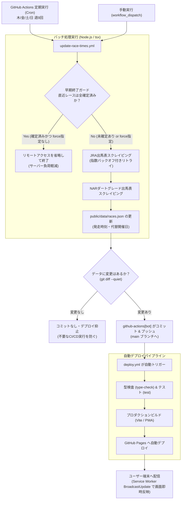

# バッチ処理・定期実行パイプライン スケジュール & 運用ガイド

本ドキュメントは、管理者および開発者向けに、本リポジトリ（`horse-racing-calendar`）で稼働する各バッチ処理・定期実行パイプライン（確定時刻自動更新、GitHub Pagesデプロイ、年間データ再生成等）の実行スケジュール、トリガー条件、手動実行コマンド、および運用・トラブルシューティング手順をまとめた運用仕様書です。

---

## 1. バッチ実行スケジュール一覧表

GitHub Actions で定期稼働するバッチおよびローカル・手動実行用の各種データ生成スクリプトの一覧です。

| バッチ名称 | ワークフロー / スクリプト | トリガー / 頻度 | 実行タイミング（JST） | Cron設定 (UTC) | 主な処理内容 | 入力・出力対象 |
| :--- | :--- | :--- | :--- | :--- | :--- | :--- |
| **確定発走時刻自動更新** | `.github/workflows/update-race-times.yml`<br>`scripts/update-race-times.ts` | GitHub Actions (cron)<br>手動 (`workflow_dispatch`) | **毎日朝**: 07:30<br>**平日昼**: 12:30<br>**平日〜土曜夕**: 17:30<br>**毎日夜**: 21:30<br>**木曜**: 16:30, 17:00, 18:00<br>**金曜**: 10:30, 11:00, 12:00 | `30 22 * * *`<br>`30 3 * * 1-5`<br>`30 8 * * 1-6`<br>`30 12 * * *`<br>`30 7 * * 4`<br>`0 8 * * 4`<br>`0 9 * * 4`<br>`30 1 * * 5`<br>`0 2 * * 5`<br>`0 3 * * 5` | JRA公式出馬表、NAR公式出馬表（ダートグレード年間日程＋各競馬場RaceList）、PMUプログラム（フランス重賞）、およびSporting Life API（イギリス重賞）から直近レースの確定発走時刻・代替開催日を取得し更新 | 入力: 公式出馬表/API<br>出力: `public/data/races.json` |
| **自動テスト・デプロイ** | `.github/workflows/deploy.yml` | push to `main`<br>手動 (`workflow_dispatch`) | 随時（PRマージ時、データ更新コミット時） | イベント駆動 | 型検査 (`type-check`)、テスト (`test`)、プロダクションビルド (`build`) を実行し GitHub Pages へ自動配信 | 入力: ソースコード<br>出力: `dist/` (GitHub Pages) |
| **年間データ一括ビルド** | `scripts/parse-races.ts` | 手動実行 (ローカル) | 年間更新時、開催日程・マスタ辞書更新時 | オンデマンド | JRA公式ICS/HTML、NARスケジュールHTML、フランス競馬マスタ、イギリス競馬マスタから全レースデータを統合マージして再生成 | 入力: 各マスタ/公式データ<br>出力: `public/data/races.json` |
| **PWAアイコン一括生成** | `scripts/generate-pwa-icons.ts` | 手動実行 (ローカル) | アプリアイコン刷新時 | オンデマンド | SVGアセットから各解像度PNGアイコンおよびファビコンを一括生成 | 入力: `src/assets/icon.svg`<br>出力: `public/icons/`, `favicon.svg` |
| **PRDドキュメントPDF生成** | `scripts/generate-prd-pdf.js` | 手動実行 (ローカル) | PRD改訂時・新機能リリース時 | オンデマンド | Headless Chrome を利用して `docs/PRD.md` から公式仕様書PDFを生成 | 入力: `docs/PRD.md`<br>出力: `docs/Horse_Racing_Calendar_PRD.pdf` |

---

## 2. 各バッチの詳細仕様と手動実行手順

### 2.1 確定発走時刻自動更新パイプライン (`update-race-times.ts`)

#### 概要・設計根拠
- **対象レース**: JRA当週開催レース（木〜翌月曜）、NAR直近7日間の全重賞（ダートグレード競走、南関重賞、各地区地方重賞、ばんえい重賞）、フランス競馬（France Galop 直近7日間）、およびイギリス競馬（BHA 直近7日間）。
- **実行スケジュールの根拠**:
  - **毎日朝 (07:30 JST)**: 当日開催レースの最終確認（悪天候による順延・代替開催の検知等）。
  - **平日昼 (12:30 JST)**: 地方競馬（NAR）の昼間開催レース直前・当日確定状況の確認。
  - **平日〜土曜夕方 (17:30 JST)**: 地方競馬（NAR）のナイター開催レース直前確認、翌日以降の出馬表更新の検知、およびJRA土曜前日夕方の確認。
  - **毎日夜 (21:30 JST)**: 欧州競馬（フランス・イギリス重賞）の当日開催直前・確定確認。
  - **木曜日 (16:30, 17:00, 18:00 JST)**: JRAの出馬表発表（通常16:00頃）に合わせ、段階的に確定時刻をフェッチ。
  - **金曜日 (10:30, 11:00, 12:00 JST)**: JRAの確定枠順・発走時刻発表（通常10:00頃）を網羅。

#### ローカル実行コマンド
```bash
# 通常実行（直近ウィンドウ内の全主催者の未確定レースを取得・更新）
npm run data:update-times

# 全件強制更新（早期終了ガードをバイパスし、すでに確定済みのレースも再確認）
npm run data:update-times -- --force

# ドライラン（ファイル書き込みを行わず、取得・更新内容の確認のみ実施）
npm run data:update-times -- --dry-run

# 特定の主催者のみを対象に実行（'jra', 'nar', 'france_galop', 'bha'）
npm run data:update-times -- --org=jra
npm run data:update-times -- --org=nar
npm run data:update-times -- --org=france_galop
npm run data:update-times:uk   # または npm run data:update-times -- --org=bha
```

#### GitHub Actions からの手動実行
1. GitHub リポジトリの **Actions** タブを開きます。
2. 左メニューから **「Update Confirmed Race Times」** ワークフローを選択します。
3. 右上の **「Run workflow」** ドロップダウンをクリックします。
4. ブランチに `main` を指定し、必要に応じて `Force update even if all races are already confirmed`（強制更新）のチェックを入れて **「Run workflow」** を実行します。

---

### 2.2 年間データ一括ビルド (`parse-races.ts`)

#### 概要
JRA公式の年間スケジュール（ICS/HTML）、NAR公式年間日程（HTML）および補完マスタ、フランス競馬（France Galop / IFHA Part I）のマスタ辞書を解析・正規化し、全レースデータを単一の `public/data/races.json` へ統合マージします。

```bash
npm run data:build
```

#### 確定発走時刻・代替開催情報の自動保持 (`preserveConfirmedRaceTimes`)
年間データを一括再ビルドした場合でも、過去のバッチによって取得・更新された **確定発走時刻（`is_time_confirmed: true`）** や **代替開催日程（`is_rescheduled: true`, `original_date`）** は失われず、既存の `public/data/races.json` から自動的に引き継がれます。これにより、年間マスタを再ビルドしても確定データが初期化される心配はありません。

---

### 2.3 PWAアイコン生成 (`generate-pwa-icons.ts`)

公式アプリアイコン（ターフグリーン `#047B5F`）を元に、PWAマニフェストおよび各OS・ブラウザ向けの全解像度PNGアセットを一括生成します。

```bash
npm run icons:generate
```

- **生成先**:
  - `public/icons/icon-72.png`, `icon-96.png`, `icon-128.png`, `icon-144.png`, `icon-152.png`, `icon-192.png`, `icon-384.png`, `icon-512.png`
  - `public/icons/apple-touch-icon.png` (180x180)
  - `public/favicon.svg`

---

### 2.4 PRD公式ドキュメントPDF生成 (`generate-prd-pdf.js`)

プロジェクト要求仕様書（`docs/PRD.md`）から、目次・見出し装飾・改ページ制御を適用した公式PDF（`docs/Horse_Racing_Calendar_PRD.pdf`）を Headless Chrome を利用して自動生成します。

```bash
npm run docs:pdf
```

---

## 3. パイプライン連携・自動化アーキテクチャ

定期バッチによって確定発走時刻が更新され、本番環境（GitHub Pages）へ自動配信されるまでの処理フローは以下のとおりです。



### 設計上の安全機能
1. **差分検知による不要デプロイの抑止 (`git diff --quiet`)**:
   取得した発走時刻に更新がない場合、コミット処理は行われません。これにより、無駄なビルド・デプロイ（GitHub Actions 実行時間の消費）を防ぎます。
2. **早期終了ガード**:
   当週・直近ウィンドウ内の全レースの発走時刻がすでに確定している場合、JRA/NAR公式サイトへのリクエストを行わずに即時終了します（`--force` 指定時を除く）。
3. **指数バックオフ付きリトライ (`fetchWithRetry`)**:
   公式サイトの一時的なネットワークエラーやサーバー高負荷（500/503等）に対し、自動で待機時間を延ばしながら最大2回までリトライします。
4. **代替開催（日程変更）の自動ハンドリング**:
   悪天候等でレースの開催日が変更された場合、出馬表の日程に基づき `races.json` の `date` を上書きし、当初日程を `original_date` に、変更フラグを `is_rescheduled: true` として自動保持します。

---

## 4. 運用・トラブルシューティング

### 4.1 GitHub Actions のバッチ失敗時の確認手順
1. GitHub リポジトリの **Actions** タブを開き、失敗したワークフロー（赤アイコン）をクリックします。
2. **`Fetch & Update Race Times`** ジョブの詳細ログを展開します。
3. エラー内容を確認します:
   - **404 Not Found**: 公式サイトのURL構造が変更された可能性があります（後述）。
   - **HTTP 500/503**: 公式サイトの一時障害の可能性が高いため、次回定期実行まで待つか、手動で `Run workflow` を再試行します。
   - **Merge conflict / Push rejected**: 同時に別のコミットが `main` にプッシュされた場合に発生します。次回実行時に自動解決されます。

### 4.2 JRA/NAR公式サイトの構造変更時の対応
公式サイトのHTMLレイアウトやURL体系が変更された場合、出馬表スクレイパーのセレクタ修正が必要になります。
- **JRAスクレイパー**: `scripts/lib/jra-syutsuba.ts`
- **NARスクレイパー**: `scripts/lib/nar-syutsuba.ts`

**修正・検証手順**:
1. ローカル作業ブランチを作成。
2. 公式サイトの最新HTML構造を確認し、正規表現またはパーサーロジックを修正。
3. ドライランで正常に時刻が取得できるかテスト:
   ```bash
   npm run data:update-times -- --force --dry-run
   ```
4. 単体テストを実行して通過を確認:
   ```bash
   npx vitest run tests/unit/jraSyutsuba.test.ts tests/unit/narSyutsuba.test.ts tests/unit/updateRaceTimes.test.ts
   ```
5. PRを作成してレビュー・マージ。

### 4.3 緊急時の手動データ修正手順
天候急変等により手動でレース日程や時刻を即座に修正したい場合:
1. `public/data/races.json` 内の該当レース（`id`）を特定。
2. 必要に応じて以下のフィールドを編集:
   - `start_time`: ISO 8601 UTC形式（例: `2026-09-20T06:40:00.000Z`）
   - `is_time_confirmed`: `true`
   - 代替開催の場合: `date` を新開催日に変更し、`original_date: "当初日付"`, `is_rescheduled: true` を付与。
3. コミットして `main` へプッシュすると、`deploy.yml` により数分で本番へ反映されます。
