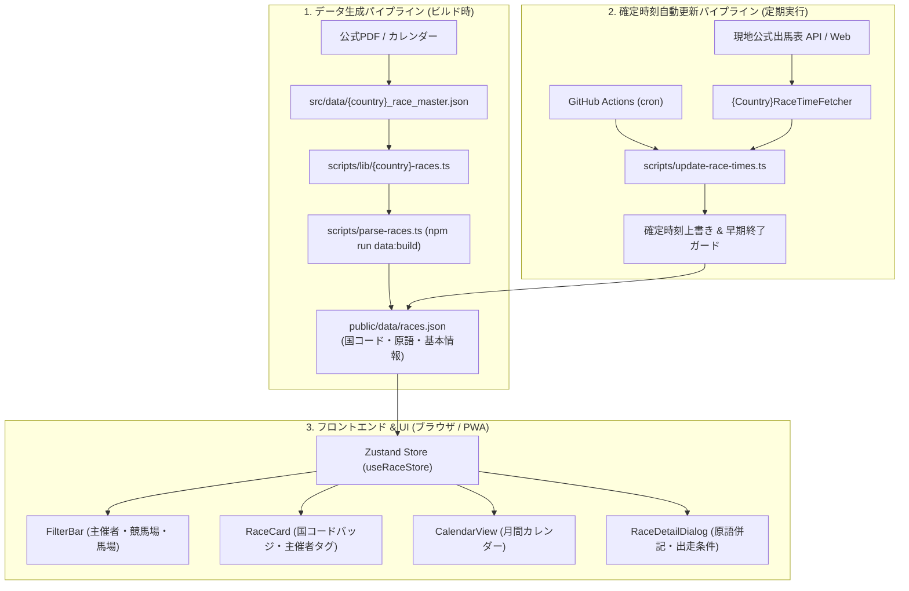

# 新しい国の競馬（海外競馬）追加 開発・運用ガイド

本ドキュメントは、`horse-racing-calendar` に新しい国・地域の競馬（イギリス、アメリカ、オーストラリア、香港など）を統合する際に、データ選定からマスタ作成、確定時刻バッチ、UI拡張、多言語化、テストまでをスムーズかつ安全に進めるための開発・運用ガイドです。

先行事例である **フランス競馬（France Galop / PMU対応: #64, #65, #66, #73, #77）** で培われた設計パターンと実装実績に基づき、各ステップの手順・コード例・注意点を網羅しています。

---

## 目次 (Table of Contents)

1. [全体アーキテクチャ & 開発ライフサイクル](#1-全体アーキテクチャ--開発ライフサイクル)
2. [Step 1: 一次データソースの選定 & 仕様調査](#2-step-1-一次データソースの選定--仕様調査)
   - [2.4 国別データ仕様書の作成（標準テンプレート）](#24-国別データ仕様書の作成標準テンプレート)
3. [Step 2: スキーマ・型定義の拡張 (`src/types/race.ts`)](#3-step-2-スキーマ型定義の拡張-srctypesracets)
4. [Step 3: レースマスタ作成 & パイプライン統合](#4-step-3-レースマスタ作成--パイプライン統合)
5. [Step 4: 確定発走時刻自動取得バッチ（`RaceTimeFetcher`）の実装](#5-step-4-確定発走時刻自動取得バッチracetimefetcherの実装)
6. [Step 5: フロントエンド & デザインシステム対応](#6-step-5-フロントエンド--デザインシステム対応)
7. [Step 6: 多言語対応（i18n）& 免責事項の整備](#7-step-6-多言語対応i18n--免責事項の整備)
8. [Step 7: テスト・品質検証 & リリース](#8-step-7-テスト品質検証--リリース)
9. [実践ケーススタディ（フランス競馬追加のTips & 注意点）](#9-実践ケーススタディフランス競馬追加のtips--注意点)
10. [次期展開候補国クイックリファレンス](#10-次期展開候補国クイックリファレンス)

---

## 1. 全体アーキテクチャ & 開発ライフサイクル

本サービスにおける海外競馬データ統合は、以下の3大柱によって構成されています。



### 追加作業の標準フェーズ（推奨PR分割）
1回のPRで全作業を行うとレビュー負荷が高くなるため、フランス競馬同様に以下の3〜4フェーズに分割して進めることを推奨します。

| Phase | 作業内容 | 対象PR・Issue例 |
| :--- | :--- | :--- |
| **Phase 1** | PRD更新、各国データ仕様書作成 (`docs/specs/data-sources/{country}.md`)、スキーマ定義 (`src/types/race.ts`) | #64, #101, #109 |
| **Phase 2** | レースマスタ作成、データ抽出、統合ビルドスクリプト組み込み | #65, #102, #110 |
| **Phase 3** | UI拡張（FilterBar, RaceCard, CalendarView, RaceDetailDialog, i18n） | #66, #103, #111 |
| **Phase 4** | 確定時刻自動取得フェッチャー (`RaceTimeFetcher`) 実装、Actions統合、過去実績補完 | #73, #86, #104, #112 |

---

> [!IMPORTANT]
> **ドキュメント分冊化方針（PRD肥大化防止ルール）**:
> 新規国を追加する際、取得元URL、競馬場コード、出馬表API構造等の詳細な技術仕様（How）は `docs/PRD.md` に直接書き込まず、必ず **`docs/specs/data-sources/{country}.md`** を新規作成してそこに記述してください。`docs/PRD.md` はプロダクト要求（What/Why）およびロードマップのみを簡潔に更新します。

---

## 2. Step 1: 一次データソースの選定 & 仕様調査

最初に対象国の競馬に関する公式一次情報を収集・精査します。

### 2.1 格付けとレース仕様の確定（IFHAリスト）
- **参照元**: **IFHA（国際競馬統轄機関連盟: International Federation of Horseracing Authorities）** の「International Cataloguing Standards Book (Part I / Part II)」
- **確認項目**:
  - 対象国における対象年（例: 2026年）の重賞一覧（G1, G2, G3）
  - 正式英語レース名
  - 開催競馬場（Venue）
  - コース距離（m または Furlongs: 1F = 約201.168m）
  - 馬場種別（芝 `turf` / ダート `dirt` / オールウェザー `aw`）
  - 出走資格（性別・年齢制限: `3yo`, `4yo_and_up`, `filly_and_mare` 等）
  - 負担重量種別（馬齢重量 `weight_for_age`, 別定 `special_weight`, ハンデ `handicap` 等）

### 2.2 年間開催カレンダーの入手
- 現地公式統轄団体（フランスなら France Galop、イギリスなら BHA、香港なら HKJC）が発行する年間開催スケジュール（カレンダーPDF、CSV、ICSファイル）を入手し、各重賞の開催予定日（日付）を特定します。

### 2.3 タイムゾーンと夏時間（DST: Daylight Saving Time）
- 海外レースの発走時刻は **現地時間（Local Time）** で発表されます。
- システム内部ではすべて **ISO 8601 UTC（例: `2026-10-04T14:05:00.000Z`）** で統一して保持するため、現地の標準時と夏時間切替日を必ず把握します。
  - **例（ヨーロッパ / フランス・イギリス等）**: 3月最終日曜〜10月最終日曜が夏時間（DST）。
  - 推定発走時刻をマスタに設定する際、夏時間期（CEST: UTC+2）と冬時間期（CET: UTC+1）で正確なUTCを算出します。

### 2.4 国別データ仕様書の作成（標準テンプレート）
調査が完了したら、実装を始める前に **`docs/specs/data-sources/{country}.md`** を新規作成します。
プロジェクト全体のフォーマット統一を保つため、必ず以下の標準テンプレート（全5章構成）をコピーして作成してください。

```markdown
# {国・地域名}（{主催団体名}）データ仕様書 ({Country} Data Specifications)

本ドキュメントは、{国・地域名}（{主催団体名}統轄、{対象レース概要}）に関するデータ仕様書です。

---

## 1. 基本メタ情報 (Metadata)

| 項目 | 設定値 / 仕様 | 備考 |
| :--- | :--- | :--- |
| **国コード (`country_code`)** | `"{CODE}"` | ISO 3166-1 alpha-2 (大文字2文字) |
| **主催者コード (`organization`)** | `"{org}"` | `Organization` 型識別子 (小文字) |
| **原語・対応言語 (`languages`)** | `ja`, `en`, ... | `LocalizedText` に格納される言語 |
| **レースID採番ルール (`id`)** | `{YYYY}-{org}-{grade}-{index}` | 例: `2026-au-g1-01` |
| **格付け体系 (`grades`)** | `G1`, `G2`, `G3` | 正規化後の `Grade` 値 |
| **マスタファイルパス** | `src/data/{country}_race_master.json` | 辞書・基本情報マスタ |
| **生成・ビルドモジュール** | `scripts/lib/{country}-races.ts` | `scripts/parse-races.ts` より統合 |

---

## 2. データソース一覧 (Data Sources)

| 分類 | ソース元 / URL | 取得形式 | 用途 |
| :--- | :--- | :--- | :--- |
| **年間日程 / カレンダー** | 公式スケジュールURL / PDF / ICS | ... | 開催日、レース一覧の抽出 |
| **格付け・出走条件** | IFHA Part I リスト等 | PDF | グレード、出走資格、斤量、距離、馬場 |
| **出馬表・確定発走時刻** | 公式出馬表Web / REST API | ... | 開催直前の確定時刻取得 |
| **過去実績補完データ** | マスタ / 公式アーカイブ | JSON | 開催済みレースのバックフィル |

---

## 3. タイムゾーン & 発走時刻仕様 (Timezone & Schedule)

- **現地タイムゾーン**: {タイムゾーン名}（略称: `{TZ}`, UTCオフセット）
- **夏時間（DST）規則**:
  - 夏時間の有無、適用期間
  - 冬時間 / 夏時間の切り替えロジック
- **UTC変換式**:
  - 現地時刻 $\rightarrow$ ISO 8601 UTC 文字列の算出規則
- **標準推定発走時刻（マスタ初期値）**:
  - 昼間開催 / ナイター開催 / 主要G1競走の発走目安時刻

---

## 4. 競馬場 & 馬場種別仕様 (Courses & Tracks)

### 4.1 登録競馬場一覧
| 競馬場名 (日本語) | 英語表記 (`en`) | 原語表記 (あれば) | 区分 / 州 / 特徴 |
| :--- | :--- | :--- | :--- |
| ... | ... | ... | ... |

### 4.2 馬場種別 (`track_type`) & 特殊競走仕様
- **採用馬場種別**: `turf` (芝), `dirt` (ダート), `aw` (オールウェザー) 等
- **特殊条件**: 直線コース、障害、特定年齢制限（`4yo` 等）の取り扱い

---

## 5. 確定発走時刻自動取得バッチ仕様 (RaceTimeFetcher)

- **プロバイダー名**: `{Country}RaceTimeFetcher`
- **実装ファイル**: `scripts/lib/{country}-syutsuba.ts`, `scripts/update-race-times.ts`
- **対象開催ウィンドウ**: 基準日（JST）から直近 {N} 日間
- **CLI実行コマンド**: `npm run data:update-times -- --org {org}`
- **定期実行スケジュール**: GitHub Actions での定期実行枠
- **名寄せ・照合アルゴリズム**:
  - レース名の表記揺れ吸収（冠名、定冠詞、グレード表記等の正規化除去）
  - 競馬場名・開催日との複合マッチング
```

---

## 3. Step 2: スキーマ・型定義の拡張 (`src/types/race.ts`)

TypeScript の型定義を拡張し、新しい国・主催者・言語を型安全に扱えるようにします。

### 3.1 `src/types/race.ts` の変更箇所

```typescript
// 1. 国コード（ISO 3166-1 alpha-2）の追加
// 既存: 'JP' | 'FR'
export type CountryCode = 'JP' | 'FR' | 'GB' | 'US' | 'HK' | 'AU';

// 2. 主催者（Organization）識別子の追加
// 既存: 'jra' | 'nar' | 'france_galop'
export type Organization = 'jra' | 'nar' | 'france_galop' | 'bha' | 'equibase' | 'hkjc';

// 3. 多言語原語プロパティの拡張（必要に応じて）
export interface LocalizedText {
  ja: string;
  en: string;
  fr?: string;
  de?: string; // ドイツ等の場合
}

// 4. 新たな特殊馬場種別があれば TrackType に追加
// 既存: 'turf' | 'dirt' | 'obstacle' | 'banei' | 'aw'
export type TrackType = 'turf' | 'dirt' | 'obstacle' | 'banei' | 'aw';

// 5. FilterState の主催者フィルター型への反映
export interface FilterState {
  searchQuery: string;
  organization: 'all' | 'jra' | 'nar' | 'france' | 'uk' | 'hk'; // 追加
  // ...
}
```

---

## 4. Step 3: レースマスタ作成 & パイプライン統合

### 4.1 マスタJSONの作成 (`src/data/{country}_race_master.json`)
フランス競馬の `src/data/france_race_master.json` をテンプレートとして作成します。

```json
{
  "venues": {
    "Ascot": {
      "ja": "アスコット",
      "en": "Ascot"
    },
    "Newmarket": {
      "ja": "ニューマーケット",
      "en": "Newmarket"
    }
  },
  "defaults": {
    "default_post_time_bst": "15:30",
    "default_post_time_gmt": "15:00"
  },
  "races": [
    {
      "id_suffix": "2026-uk-g1-01",
      "name": {
        "ja": "2000ギニー",
        "en": "2000 Guineas Stakes"
      },
      "grade": "G1",
      "date": "2026-05-02",
      "start_time": "2026-05-02T14:35:00.000Z",
      "is_time_confirmed": false,
      "course_key": "Newmarket",
      "distance": 1609,
      "track_type": "turf",
      "sex_constraint": "colt_and_filly",
      "age_constraint": "3yo",
      "handicap": {
        "code": "weight_for_age",
        "ja": "定量",
        "en": "Weight for Age"
      }
    }
  ]
}
```

### 4.2 レースIDの命名規則
ID体系は一意性を担保するため、以下の規則で統一します。
`{YYYY}-{country}-{grade}-{2桁インデックス}`
- 例: `2026-uk-g1-01`, `2026-us-g1-05`, `2026-hk-g1-02`

### 4.3 抽出・変換モジュール (`scripts/lib/{country}-races.ts`)
マスタJSONを読み込み、共通の `RaceOutput[]` 配列へ変換・バリデーションを行う関数を実装します。

```typescript
import fs from 'node:fs';
import path from 'node:path';
import type { RaceOutput } from '../parse-races';

export function loadCountryRaceMaster(rootDir: string = process.cwd()): CountryMasterData {
  const masterPath = path.join(rootDir, 'src', 'data', 'uk_race_master.json');
  return JSON.parse(fs.readFileSync(masterPath, 'utf8'));
}

export function getCountryRaces(rootDir: string = process.cwd()): RaceOutput[] {
  const master = loadCountryRaceMaster(rootDir);
  return master.races.map((r) => ({
    id: r.id_suffix,
    organization: 'bha',
    country_code: 'GB',
    name: r.name,
    grade: r.grade,
    date: r.date,
    start_time: r.start_time,
    is_time_confirmed: r.is_time_confirmed,
    course: {
      ja: master.venues[r.course_key]?.ja ?? r.course_key,
      en: master.venues[r.course_key]?.en ?? r.course_key,
    },
    distance: r.distance,
    track_type: r.track_type,
    sex_constraint: r.sex_constraint,
    age_constraint: r.age_constraint,
    handicap: r.handicap,
  }));
}
```

### 4.4 メインビルダーへの統合 (`scripts/parse-races.ts`)
`scripts/parse-races.ts` に新規国のレース取得処理を追加し、JRA・NARとマージして日付昇順でソートします。
この際、`preserveConfirmedRaceTimes` 処理により、過去バッチで確定した発走時刻や代替開催日（`is_rescheduled`）が自動保持されることを確認します。

```bash
# マージ生成のテスト
npm run data:build
```

---

## 5. Step 4: 確定発走時刻自動取得バッチ（`RaceTimeFetcher`）の実装

レース開催週に確定発走時刻（出馬表確定時）を自動取得し、`public/data/races.json` を更新するフェッチャーを構築します。

### 5.1 スクレイパー/APIクライアントの実装 (`scripts/lib/{country}-syutsuba.ts`)
- 現地公式API（例: PMU API, Sporting Life, Racing Post 等）または出馬表HTMLを取得します。
- **耐障害性**: 指数バックオフ付きリトライ（`fetchWithRetry`）を必ず組み込みます。
- **レース名マッチング**: 冠名スポンサー名（例: "Qatar Prix de l'Arc de Triomphe" vs "Prix de l'Arc de Triomphe"）の揺らぎを吸収する正規化ロジックを実装します。

### 5.2 プロバイダーの実装と登録 (`scripts/update-race-times.ts`)

```typescript
export class UkRaceTimeFetcher implements RaceTimeFetcher {
  readonly organization = 'bha';

  getTargetWindowRaces(races: RaceOutput[], refDate: string): RaceOutput[] {
    // 直近7日間の対象国レースを抽出
    const { startDate, endDate } = getUpcomingWindowRange(refDate, 7);
    return races.filter(
      (r) => r.organization === this.organization && r.date >= startDate && r.date <= endDate
    );
  }

  async fetchConfirmedTimes(targetRaces: RaceOutput[]): Promise<ConfirmedRaceTime[]> {
    return await fetchUkConfirmedRaceTimes(targetRaces);
  }
}

// DEFAULT_FETCHERS に登録
export const DEFAULT_FETCHERS: Record<string, RaceTimeFetcher> = {
  jra: new JraRaceTimeFetcher(),
  nar: new NarRaceTimeFetcher(),
  france: new FranceRaceTimeFetcher(),
  uk: new UkRaceTimeFetcher(), // 追加
};
```

### 5.3 GitHub Actions ワークフローへのスケジュール追加 (`.github/workflows/update-race-times.yml`)
対象国の出走確定タイミングおよび現地発走時間帯に合わせて、cron スケジュールを追加します。
- 例: 欧州レースの場合、日本時間夜間（21:30 JST 等）に追加。

### 5.4 過去レース実績のバックフィル（重要）
年度途中（例: 9月）に新規国を追加した場合、1月〜8月に終了したレースは出馬表バッチでは取得できません。
1. 現地公式の年間リザルトから確定実績発走時刻を収集。
2. `src/data/{country}_race_master.json` 内の該当過去レースに正確な `start_time`（UTC）と `"is_time_confirmed": true` を埋め込み。
3. `npm run data:build` を実行して `public/data/races.json` に反映。

---

## 6. Step 5: フロントエンド & デザインシステム対応

### 6.1 `FilterBar.tsx` の拡張
1. **主催者セグメントコントロール**:
   `orgOptions` に新規国を追加（例: `{ value: 'uk', label: t('filter.orgUk') }`）。
2. **競馬場グルーピング (`COURSE_GROUPS`)**:
   競馬場選択ドロップダウンに新グループ（例: `uk: { label: 'イギリス (UK)', courses: [...] }`）を追加。
3. **馬場種別**:
   必要に応じて新設チップ（例: `AW`）を表示。

### 6.2 バッジ表示の実装
各UIコンポーネントで国コードバッジおよび主催者名バッジをレンダリングします。

- **`RaceCard.tsx` / `CalendarView.tsx` / `RaceDetailDialog.tsx`**:
  ```tsx
  {race.country_code && (
    <span className="inline-flex items-center px-1.5 py-0.5 rounded text-[10px] font-bold bg-muted text-muted-foreground border">
      {race.country_code}
    </span>
  )}
  ```

### 6.3 レース名表示・原語併記の統一仕様 (`src/libs/raceLanguage.ts`)

レースカード（`RaceCard.tsx`）およびレース詳細ダイアログ（`RaceDetailDialog.tsx`）では、言語が増加しても画面が煩雑化せず、かつ直感的に把握できるよう、以下の**統一多言語表示ルール**（`getRaceDisplayNames(race, currentLang)`）を厳格に適用します。

| 項目 | 表示ルール |
| :--- | :--- |
| **メイン表示 (Primary)** | **現在の選択言語（UI言語）** でのレース名。 |
| **サブ表示 (Secondary)** | **レース開催国の原語（Origin Language）** でのレース名。<br>ただし、**選択言語と原語が一致する場合は「英語（en）」** を表示。 |
| **同一文字列の非表示** | メイン表示とサブ表示の文字列が完全一致する場合（大文字・小文字、前後の空白を除いて同値の場合）、**サブ表示を自動的に非表示（省略）** とする。 |

#### 原語（Origin Language）の判定ロジック
`src/libs/raceLanguage.ts` 内の `getRaceOriginLanguage(race)` に、新規追加国の判定を追加します:
- フランス (`country_code === 'FR'` または `organization === 'france_galop'`): `'fr'`
- 日本 (`country_code === 'JP'` または `jra` / `nar`): `'ja'`
- イギリス (`GB` / `bha`)、アメリカ (`US`) 等: `'en'`
- 香港 (`HK` / `hkjc`): `'zh'` (または `'zh-HK'`)

#### 表示具体例
- **凱旋門賞（原語: fr, 仏名: Prix de l'Arc de Triomphe, 英名: Prix de l'Arc de Triomphe）**:
  - 日本語UI (`ja`): メイン「凱旋門賞」、サブ「Prix de l'Arc de Triomphe (原語fr)」
  - 英語UI (`en`): メイン「Prix de l'Arc de Triomphe」、サブ非表示（原語frと完全同一のため省略）
  - フランス語UI (`fr`): メイン「Prix de l'Arc de Triomphe」、サブ非表示（原語＝選択言語のためサブ候補enとなるが、同一文字列のため省略）
- **日本ダービー（原語: ja, 日名: 東京優駿, 仏名: Derby Japonais, 英名: Tokyo Yushun (Japanese Derby)）**:
  - フランス語UI (`fr`): メイン「Derby Japonais」、サブ「東京優駿 (原語ja)」
  - 英語UI (`en`): メイン「Tokyo Yushun (Japanese Derby)」、サブ「東京優駿 (原語ja)」
  - 日本語UI (`ja`): メイン「東京優駿」、サブ「Tokyo Yushun (Japanese Derby) (原語ja＝選択言語のため英語)」

### 6.4 検索エンジンの拡張 (`src/store/useRaceStore.ts`)
フィルター検索時、原語名称（`race.name.fr` 等）でも部分一致検索できるように `matchesSearchQuery` を更新します。

---

## 7. Step 6: 多言語対応（i18n）& 免責事項の整備

### 7.1 多言語対応（i18n）の整備

多言語対応には、「① 既存辞書（ja/en）への競馬用語追加（必須）」と、「② サイト自体のUI言語（第3言語）追加（オプション・発展）」の2段階があります。

#### 7.1.1 既存UI辞書への新国キー追加（必須）
`src/libs/i18n.ts` の日本語（`ja`）および英語（`en`）の双方に以下を追加します:
- `filter.org{Country}`: 主催者名（例: `UK (イギリス)` / `UK (BHA)`）
- `filter.courseGroup{Country}`: 競馬場グループ名
- 競馬場名の対訳（マスタで定義された表記と同期）

#### 7.1.2 サイトUIの母国語（第3言語）サポート（オプション・発展）
新設国（例: フランス、香港等）の母国語（フランス語 `fr`、繁体字中国語 `zh-HK` 等）をサイト全体のUI言語として正式サポートする場合は、以下のサイト規模拡張を行います:

1. **他国レース名のデータ作成方針（フォールバックとカバー範囲）**:
   > [!IMPORTANT]
   > **他国の全地方重賞まで新言語のレース名を用意・保守する必要はありません。**
   > - **地方重賞等のフォールバック**: 他言語データがないレースは、`getLocalizedText` により自動的に **英語（`en`）へフォールバック** します（`name[lang] || name.en || name.ja`）。
   > - **主要G1への名称追加**: 世界的に著名な **主要G1（日本ダービー、ジャパンカップ、有馬記念、天皇賞など）** についてのみ、その言語の公式・慣用名称（例: `Derby Japonais`, `Coupe du Japon` 等）をマスタ／パース処理（`scripts/parse-races.ts` 等）で追加します。
2. **言語ストアの拡張 (`src/store/useLanguageStore.ts`)**:
   - `Language` 型への新言語追加（例: `'ja' | 'en' | 'fr'`）。
   - `getInitialLanguage()` でのブラウザ言語（`navigator.language`）判定の追加。
3. **新言語UI辞書の新設 (`src/libs/i18n.ts`)**:
   - `translations.{lang}` を定義し、全UI文言（ナビゲーション、ステータス、ダイアログ、フィルター、空状態、免責事項、日付・曜日フォーマット等）の対訳を網羅。
   - **PWAインストール時アプリ名称（短縮名・正式名）の定義（必須）**:
     - `app.appName`: ホーム画面アイコン下に表示される短縮アプリ名（例: 日本語なら `重賞カレンダー`、英語なら `Graded Races`、フランス語なら `Courses de Groupe`）。
     - `app.appFullName`: インストールダイアログやタイトル用の正式アプリ名（例: `Calendrier des Courses de Groupe`）。
     - これらは `src/libs/pwaMetadata.ts` を通じて iOS ホーム画面用メタタグ（`apple-mobile-web-app-title`）および Webアプリ名メタタグ（`application-name`）へ動的に同期されます。
   - `i18n.test.ts` で既存言語辞書とのキー完全一致（パリティ）を自動検証。
4. **言語切替UIの選択肢追加 (`src/components/shared/Header.tsx`)**:
   - Shadcn UI `Select` コンポーネントに新言語の選択肢アイテム（例: `<SelectItem value="fr">Français (FR)</SelectItem>`）を追加。
5. **メタ情報・ロケールの同期 (`index.html`)**:
   - Schema.org JSON-LD の `inLanguage` に新言語を追加、OGP（`og:locale:alternate`）の同期、サイト別名（`alternateName`）の追加。
6. **テストの拡充**:
   - `useLanguageStore.test.ts`, `Header.test.tsx`, `i18n.test.ts`, `raceLanguage.test.ts`, `pwaMetadata.test.ts`, `i18nIntegration.test.tsx` の言語切り替えテストを更新。

### 7.2 免責事項・データ出典の追記 (`DisclaimerDialog.tsx` & `i18n.ts`)
- **非公式ファンサイト注記**: 新規統轄団体（BHA, Equibase等）と本アプリが無関係である旨を追記。
- **データ出典**: 新規団体の公式発表データを利用・加工している旨を明記。
- **商標・知的財産権**: 新規団体の権利帰属を追記。

### 7.3 SEO & メタ情報（`index.html` / OGP / PWA Manifest）の更新
海外競馬や対象国の追加に合わせて、検索エンジンへの最適化（SEO）およびSNSシェア（OGP）の文言・構造化データを適宜更新・汎用化します。

1. **`index.html` のメタタグ**:
   - `<meta name="description">`: 新規追加国の主要重賞を含む説明文（日英）の更新。
   - `<meta name="keywords">`: 新規国の競馬関連キーワード（国名、統轄団体名等）の追加。
   - **OGP / Twitter Card**: `og:description` や `twitter:description` を更新。
   - **JSON-LD 構造化データ**: Schema.org（`@type: WebApplication`）の `description` や `alternateName` の同期。
2. **`vite.config.ts` (PWA Manifest) およびホーム画面メタ情報**:
   - `VitePWA` プラグイン内の `manifest.description` を更新。
   - **PWAインストール時のアプリ名称（`apple-mobile-web-app-title` / `application-name`）への新言語追加（必須）**:
     - 新規言語を追加した際は、`src/libs/i18n.ts` の `app.appName`（短縮名）および `app.appFullName`（正式名）に対訳を必ず登録してください。
     - アプリケーション起動時および言語切り替え時に `src/libs/pwaMetadata.ts` が自動実行され、iOS Safari 用メタタグ（`apple-mobile-web-app-title`）および `application-name` が現在の選択言語に合わせて動的に同期されます。
     - なお、Android の WebAPK による余白なし全画面 maskable アイコン描画を保証するため、Web App Manifest ファイル自体はビルド時に静的配信されます。
     - `tests/unit/pwaMetadata.test.ts` に新言語でのテストケースを追加し、メタタグが正常に反映されることを確認します。

---

## 8. Step 7: テスト・品質検証 & リリース

### 8.1 必要な単体テスト一覧
新規追加時は、既存のテストスイートに影響を与えないよう、以下の単体テストを必ず作成・拡充します。

1. **マスタ・データ整合性テスト (`tests/unit/{country}Races.test.ts`)**:
   - 全レースが必須プロパティ（ID、名前、日付、UTC時刻、コース、距離）を保持していること。
   - レースIDが一意であること。
   - 競馬場キーが `venues` に定義されていること。
2. **スクレイパー/フェッチャーテスト (`tests/unit/{country}Syutsuba.test.ts`)**:
   - 出馬表レスポンス（フィクスチャHTML/JSON）から正しく確定時刻が抽出・ISO変換されること。
   - タイムゾーン（夏時間・冬時間）が正確にUTC変換されること。
   - リトライ機構（エラー時の指数バックオフ）が動作すること。
3. **バッチ統合テスト (`tests/unit/updateRaceTimes.test.ts`)**:
   - `--org={country}` オプションで正常にフィルタリング実行できること。
4. **UIコンポーネントテスト**:
   - `FilterBar.test.tsx`: 新規主催者フィルターの切替、競馬場グループ選択の検証。
   - `RaceCard.test.tsx` / `RaceDetailDialog.test.tsx`: 国コードバッジや原語表記が表示されること。
   - `useRaceStore.test.ts`: 新規国のレースが検索・フィルタリングできること。
5. **SEO・メタ設定テスト (`tests/unit/seo.test.ts`)**:
   - `index.html` の meta タグや JSON-LD、OGP を更新した場合は、本テストの期待値も同期して更新すること。

### 8.2 品質チェックリスト
作業完了時は、リポジトリ規約に基づき以下のコマンドをすべてパスすることを確認します。

```bash
# 1. TypeScript 型検査 (エラー 0 件)
npm run type-check

# 2. 全単体・統合テスト (すべて PASS)
npm test

# 3. プロダクションビルド検証 (正常完了 & バンドル生成)
npm run build

# 4. 公式PRD仕様書PDFの再生成
npm run docs:pdf
```

---

## 9. 実践ケーススタディ（フランス競馬追加のTips & 注意点）

フランス競馬（France Galop）を追加した際に実際に直面した課題と解決策です。次回以降の追加時に参考にしてください。

### ① 夏時間切替日による時差のズレ
- **課題**: フランスでは10月最終日曜日に夏時間（UTC+2）から冬時間（UTC+1）に切り替わります。同じ「現地15:00発走」でも、10月上旬は `13:00 UTC`、11月上旬は `14:00 UTC` となり、日本時間（JST）との時差が変わります。
- **対策**: 日付ベースで `isSummerTime(date)` を判定するヘルパーを実装し、マスタ作成スクリプトおよびスクレイパーで厳密にUTCオフセットを算出しました。

### ② スポンサー冠名によるレース名の表記揺れ
- **課題**: 公式カレンダーや出馬表では、スポンサー名が付加されたり省略されたりします（例: `Qatar Prix de l'Arc de Triomphe` vs `Prix de l'Arc de Triomphe`）。
- **対策**: スポンサー名や定冠詞（`DE`, `DU`, `LE`, `LA` 等）を除去・正規化してマッチングする `normalizeRaceName()` 関数を導入しました。

### ③ レース中止・廃止の公式アナウンス
- **課題**: 年初スケジュールに記載されていたペネロープ賞（Prix Penelope）が、フランスギャロの公式発表により開催廃止となっていました。
- **対策**: 単に年間PDFを盲信するだけでなく、現地公式アナウンスを確認し、廃止レースはマスタから適切に除外（または代替設定）しました。

### ④ 多言語表示ルールの確立（サブ表示増加の防止とフォールバック方針）
- **課題**: サイトUI言語を増やす際、レースカードのサブ言語を単純に羅列すると画面が肥大化し視認性が悪化する。また、他国（日本等）の全地方重賞まで新言語の辞書を作成・保守するのは非現実的。
- **対策**:
  1. **表示ルール**: メイン＝選択言語、サブ＝開催国原語（選択言語と原語が同じ場合は英語）。メインとサブの文字列が一致する場合はサブを自動非表示化。
  2. **辞書範囲**: 地方重賞等は英語フォールバックで吸収し、世界的な主要G1（日本ダービー、ジャパンカップ、有馬記念、天皇賞等）のみ新言語名称を整備する方針を確立。

---

## 10. 次期展開候補国クイックリファレンス

今後の機能拡張（ロードマップ）で予定されている主要国の基本情報です。

| 国・地域 | 統轄団体 / 公式元 | 国コード | 主要競馬場 | タイムゾーン | 想定馬場 | ステータス |
| :--- | :--- | :--- | :--- | :--- | :--- | :--- |
| **フランス (France)** | France Galop | `FR` | Longchamp, Chantilly, Deauville, Saint-Cloud | CET (UTC+1) / CEST (UTC+2) | 芝 (Turf), オールウェザー (AW) | **対応済み (v1.19.0)** |
| **イギリス (UK)** | British Horseracing Authority (BHA) | `GB` | Ascot, Newmarket, Epsom, York, Doncaster, Goodwood | GMT (UTC+0) / BST (UTC+1) | 芝 (Turf), オールウェザー (AW) | **対応済み (v1.23.0)** |
| **アメリカ (USA)** | The Jockey Club / Equibase | `US` | Churchill Downs, Belmont Park, Saratoga, Santa Anita, Del Mar | ET / CT / MT / PT (夏時間あり) | ダート (Dirt), 芝 (Turf) | **対応済み (v1.28.0)** |
| **香港 (HK)** | Hong Kong Jockey Club (HKJC) | `HK` | 沙田 (Sha Tin), 快活谷 (Happy Valley) | HKT (UTC+8, 通年固定) | 芝 (Turf), オールウェザー (AW) | **対応済み (v1.30.0)** |
| **オーストラリア (AUS)** | Racing Australia | `AU` | Flemington, Randwick, Caulfield, Rosehill, Moonee Valley | AEST (UTC+10) / AEDT (UTC+11) ※南半球 | 芝 (Turf) | 次期候補 |
| **UAE (ドバイ)** | Emirates Racing Authority (ERA) | `AE` | Meydan, Jebel Ali, Abu Dhabi | GST (UTC+4, 通年固定) | ダート (Dirt), 芝 (Turf) | 次期候補 |
