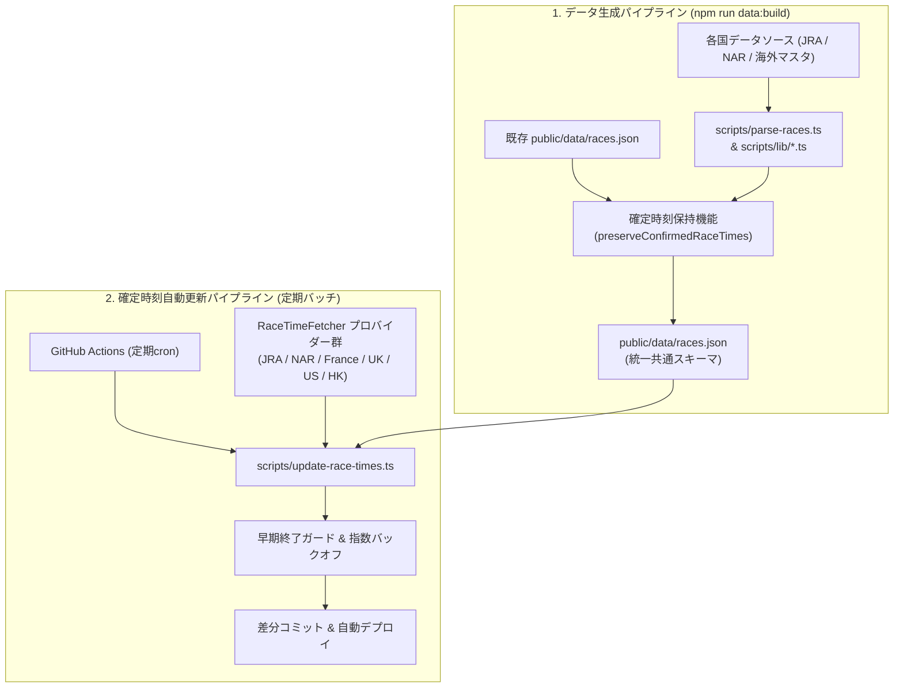

# データパイプライン共通仕様書 (Data Pipeline Specifications)

本ドキュメントは、`horse-racing-calendar` におけるデータ生成パイプライン（ビルド時）、確定発走時刻自動更新パイプライン（定期実行時）、共通データスキーマ、およびデータ保護機能の技術仕様を定義した正本です。

---

## 1. パイプライン全体アーキテクチャ

本サービスのデータ基盤は、静的ビルド時の「データ統合・生成パイプライン」と、運用時の「確定発走時刻自動更新パイプライン」の2系統で構成されています。



---

## 2. アプリケーション共通データスキーマ (`public/data/races.json`)

すべてのレースデータは、多言語（日/英/仏/中）オブジェクト形式を含む統一スキーマで `public/data/races.json` に出力されます。

### 2.1 型定義仕様 (`RaceOutput`)

```typescript
export interface RaceOutput {
  id: string;                    // 一意なレースID: {YYYY}-{org}-{grade_code}-{index}
  organization: Organization;    // 主催団体コード: 'jra' | 'nar' | 'france_galop' | 'bha' | 'equibase' | 'hkjc'
  country_code: string;          // ISO 3166-1 alpha-2 国コード: 'JP' | 'FR' | 'GB' | 'US' | 'HK'
  name: LocalizedText;           // レース名 { ja: string; en: string; fr?: string; zh?: string }
  grade: Grade;                  // 格付け: 'G1'|'G2'|'G3'|'J.G1'|'J.G2'|'J.G3'|'Jpn1'|'Jpn2'|'Jpn3'|'S1'|'S2'|'S3'|'local_grade'
  date: string;                  // 開催日 (YYYY-MM-DD)
  start_time: string;            // 発走予定時刻 (ISO 8601 UTC 文字列, 例: "2026-05-02T14:35:00.000Z")
  is_time_confirmed: boolean;    // 発走時刻確定フラグ (公式発表前は false, 確定後は true)
  is_rescheduled: boolean;       // 代替開催・順延フラグ
  original_date: string;         // 当初予定日 (YYYY-MM-DD)
  course: LocalizedCourse;       // 競馬場名 { ja: string; en: string; fr?: string; zh?: string }
  distance: number;              // 競走距離 (メートル整数型, 例: 1600, ばんえいは 200)
  track_type: TrackType;         // 馬場種別: 'turf' | 'dirt' | 'aw' | 'obstacle' | 'banei'
  sex_constraint: SexConstraint; // 性別制限: 'none' | 'filly_and_mare' | 'colt_and_filly'
  age_constraint: AgeConstraint; // 年齢制限: 'none' | '2yo' | '3yo' | '4yo' | '3yo_and_up' | '4yo_and_up'
  handicap: HandicapInfo;        // 負担重量区分 { code: HandicapType; ja: string; en: string; fr?: string }
}
```

### 2.2 ID採番標準ルール
- 書式: `{YYYY}-{org}-{grade_code}-{index}`
  - JRA G1例: `2026-jra-g1-01`
  - NAR Jpn1例: `2026-nar-jpn1-01`
  - NAR 国際G1例: `2026-nar-g1-01`（東京大賞典）
  - NAR 南関重賞例: `2026-nar-s1-01`
  - NAR 地方重賞例: `2026-nar-local-01`
  - フランスG1例: `2026-france-g1-01`（凱旋門賞等）
  - イギリスG1例: `2026-uk-g1-01`（2000ギニー等）
  - アメリカG1例: `2026-us-g1-01`（ケンタッキーダービー等）
  - 香港G1例: `2026-hk-g1-01`（香港カップ等）

---

## 3. レース属性の標準化ルール

### 3.1 馬場種別 (`track_type`)
- **`turf`（芝）**: 国内外の平地芝コース。
- **`dirt`（ダート）**: 国内外のダートコース。
- **`aw`（オールウェザー / All Weather）**: フランスPSF（Piste en Sable Fibré）、イギリス・アメリカ等の全天候型コース。
- **`obstacle`（障害 / Jump）**: JRA障害競走（J.G1〜J.G3）。
- **`banei`（ばんえい）**: 帯広競馬場での直線200mそり競走。

### 3.2 出走資格（性別・年齢制限）
- **性別制限 (`sex_constraint`)**:
  - `colt_and_filly`: 牡・牝限定（せん馬不可、例: クラシック三冠）
  - `filly_and_mare`: 牝馬限定
  - `none`: 制限なし（全馬出走可）
- **年齢制限 (`age_constraint`)**:
  - `2yo`: 2歳限定
  - `3yo`: 3歳限定
  - `4yo`: 4歳限定（香港クラシックシリーズ等）
  - `3yo_and_up`: 3歳以上
  - `4yo_and_up`: 4歳以上
  - `none`: 制限なし

### 3.3 負担重量区分 (`handicap`)
- **定量 (`weight_for_age`)**: 馬齢重量、国際基準の定量戦。
- **馬齢 (`special_weight`)**: 各国・各団体の馬齢別重量規定。
- **別定 (`set_weight`)**: 賞金別定・グレード別定。
- **ハンデ (`handicap`)**: ハンデキャップ競走。

---

## 4. 確定発走時刻の保護ロジック (`preserveConfirmedRaceTimes`)

### 4.1 課題と目的
年間のデータ生成スクリプト（`npm run data:build`）を実行すると、一次マスタやカレンダーからデータを再パースするため、運用中に自動取得された「出馬表発表後の確定発走時刻（`is_time_confirmed: true`）」や「天候による代替開催情報（`is_rescheduled: true`）」が初期値へ巻き戻ってしまうリスクがあります。

### 4.2 保持メカニズム
`scripts/parse-races.ts` は、新規ビルドデータを出力する直前に既存の `public/data/races.json` を読み込み、以下の情報をレースID照合で自動マージ・復元します。
1. `is_time_confirmed: true` の場合:
   - 確定発走時刻（`start_time`）および `is_time_confirmed` を復元。
2. `is_rescheduled: true` の場合:
   - 変更後開催日（`date`）、発走時刻（`start_time`）、`is_rescheduled`、および `original_date` を復元。

---

## 5. 確定時刻自動更新バッチ設計 (`RaceTimeFetcher`)

### 5.1 プロバイダーアーキテクチャ (Strategyパターン)
主催者ごとに異なる出馬表取得元（Webスクレイピング、REST API、HTML）を共通インターフェースでカプセル化しています。

```typescript
export interface RaceTimeFetcher {
  readonly organization: string;
  getTargetWindowRaces(races: RaceOutput[], refDate: string): RaceOutput[];
  fetchConfirmedTimes(targetRaces: RaceOutput[]): Promise<ConfirmedRaceTime[]>;
}
```

### 5.2 実装プロバイダー一覧
| プロバイダー | 主催団体 | 対象ウィンドウ | データソース |
| :--- | :--- | :--- | :--- |
| `JraRaceTimeFetcher` | JRA | 週末金〜月 | JRA公式出馬表HTML |
| `NarRaceTimeFetcher` | NAR | 直近7日間 | keiba.go.jp ダートグレード日程 & 当日RaceList |
| `FranceRaceTimeFetcher` | France Galop | 直近7日間 | PMU REST API (`offline.turfinfo.api.pmu.fr`) |
| `UkRaceTimeFetcher` | BHA | 直近7日間 | Sporting Life API (`sportinglife.com/api`) |
| `UsRaceTimeFetcher` | Equibase | 直近7日間 | Equibase Web出馬表 JSON |
| `HkRaceTimeFetcher` | HKJC | 直近7日間 | HKJC 出馬表 HTML |

### 5.3 早期終了ガード & 指数バックオフ
1. **早期終了ガード**:
   各プロバイダーの対象ウィンドウ内に未確定（`is_time_confirmed: false`）レースが存在しない場合、外部へのHTTPリクエストを一切送信せず即座に終了します（サーバー負荷およびCI実行時間の削減）。
2. **指数バックオフリトライ**:
   外部ネットワークの一時的タイムアウトや HTTP 429/5xx エラーに対し、最大3回のリトライを実施します。

---

## 6. 関連ドキュメント
- 各国のデータ詳細仕様:
  - [JRA仕様](file:///c:/Users/meshi/git/horse-racing-calender/docs/specs/data-sources/jra.md)
  - [NAR仕様](file:///c:/Users/meshi/git/horse-racing-calender/docs/specs/data-sources/nar.md)
  - [フランス仕様](file:///c:/Users/meshi/git/horse-racing-calender/docs/specs/data-sources/france.md)
  - [イギリス仕様](file:///c:/Users/meshi/git/horse-racing-calender/docs/specs/data-sources/uk.md)
  - [アメリカ仕様](file:///c:/Users/meshi/git/horse-racing-calender/docs/specs/data-sources/us.md)
  - [香港仕様](file:///c:/Users/meshi/git/horse-racing-calender/docs/specs/data-sources/hk.md)
- [定期バッチスケジュール・運用仕様書](file:///c:/Users/meshi/git/horse-racing-calender/docs/batch-schedules.md)
- [新国追加ガイド](file:///c:/Users/meshi/git/horse-racing-calender/docs/guides/adding-new-country.md)
