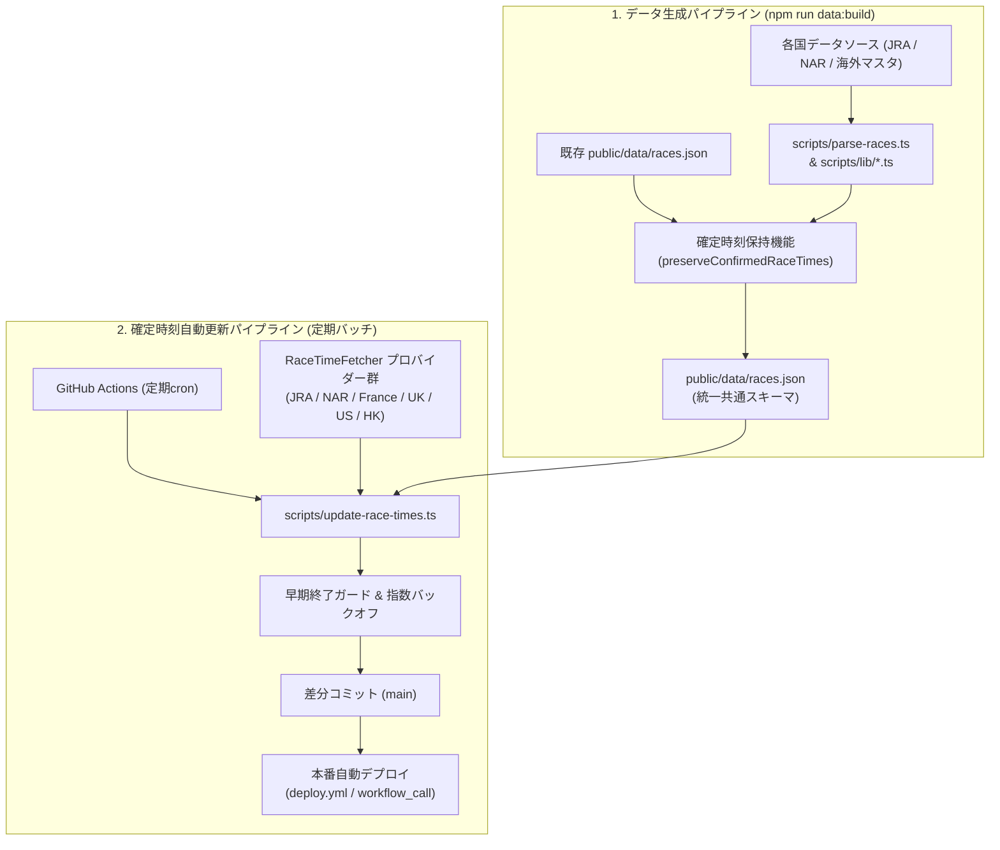

# データパイプライン共通仕様書 (Data Pipeline Specifications)

本ドキュメントは、`horse-racing-calendar` におけるデータ生成パイプライン（ビルド時）、確定発走時刻自動更新パイプライン（定期実行時）、共通データスキーマ、およびデータ保護機能の技術仕様を定義した正本です。

---

## 1. パイプライン全体アーキテクチャ

本サービスのデータ基盤は、静的ビルド時の「データ統合・生成パイプライン」と、運用時の「確定発走時刻自動更新パイプライン」の2系統で構成されています。


```mermaid
flowchart TD
    subgraph BuildPipeline["1. データ生成パイプライン (npm run data:build)"]
        Sources["各国データソース (JRA / NAR / 海外マスタ)"] --> ParseScripts["scripts/parse-races.ts<br>& scripts/lib/*.ts"]
        OldRaces["既存 public/data/races.json"] --> Preserve["確定時刻保持機能<br>(preserveConfirmedRaceTimes)"]
        ParseScripts --> Preserve
        Preserve --> OutputRaces["public/data/races.json<br>(統一共通スキーマ)"]
    end

    subgraph CronPipeline["2. 確定時刻自動更新パイプライン (定期バッチ)"]
        GitHubActions["GitHub Actions (定期cron)"] --> UpdateScript["scripts/update-race-times.ts"]
        Providers["RaceTimeFetcher プロバイダー群<br>(JRA / NAR / France / UK / US / HK)"] --> UpdateScript
        OutputRaces --> UpdateScript
        UpdateScript --> Guard["早期終了ガード & 指数バックオフ"]
        Guard --> Commit["差分コミット (main)"]
        Commit --> Deploy["本番自動デプロイ<br>(deploy.yml / workflow_call)"]
    end
```

---

## 2. アプリケーション共通データスキーマ (`public/data/races.json`)

すべてのレースデータは、多言語（日/英/仏/中）オブジェクト形式を含む統一スキーマで `public/data/races.json` に出力されます。

### 2.1 型定義仕様 (`RaceOutput`)

```typescript
export interface RaceWinner {
  name: LocalizedText;        // 勝ち馬名 { ja: string; en: string; fr?: string; zh?: string }
  jockey?: LocalizedText;     // 騎手名（オプション）
  horse_number?: number;      // 馬番（オプション）
  time?: string;              // 走破タイム（オプション、例: "2:24.1"）
}

export interface RaceOutput {
  id: string;                    // 一意なレースID: {YYYY}-{org}-{grade_code}-{index}
  organization: Organization;    // 主催団体コード: 'jra' | 'nar' | 'france_galop' | 'bha' | 'equibase' | 'hkjc'
  country_code: string;          // ISO 3166-1 alpha-2 国コード: 'JP' | 'FR' | 'GB' | 'US' | 'HK'
  name: LocalizedText;           // レース名 { ja: string; en: string; fr?: string; zh?: string }
  grade: Grade;                  // 格付け: 'G1'|'G2'|'G3'|'J.G1'|'J.G2'|'J.G3'|'Jpn1'|'Jpn2'|'Jpn3'|'S1'|'S2'|'S3'|'local_grade'
  date: string;                  // 開催日 (YYYY-MM-DD)
  start_time: string;            // 発走予定時刻 (ISO 8601 UTC 文字列, 例: "2026-05-02T14:35:00.000Z")
  is_time_confirmed: boolean;    // 発走時刻確定フラグ (公式発表前は false, 確定後は true)
  is_rescheduled: boolean;       // 代替開催・順延フラグ
  original_date: string;         // 当初予定日 (YYYY-MM-DD)
  course: LocalizedCourse;       // 競馬場名 { ja: string; en: string; fr?: string; zh?: string }
  distance: number;              // 競走距離 (メートル整数型, 例: 1600, ばんえいは 200)
  track_type: TrackType;         // 馬場種別: 'turf' | 'dirt' | 'aw' | 'obstacle' | 'banei'
  sex_constraint: SexConstraint; // 性別制限: 'none' | 'filly_and_mare' | 'colt_and_filly'
  age_constraint: AgeConstraint; // 年齢制限: 'none' | '2yo' | '3yo' | '4yo' | '3yo_and_up' | '4yo_and_up'
  handicap: HandicapInfo;        // 負担重量区分 { code: HandicapType; ja: string; en: string; fr?: string }
  winner?: RaceWinner;           // 勝ち馬・レース結果（着順確定後）
  official_url?: string;         // 各主催者・出馬表等の公式情報URL
}
```

### 2.2 ID採番標準ルール
- 書式: `{YYYY}-{org}-{grade_code}-{index}`
  - JRA G1例: `2026-jra-g1-01`
  - NAR Jpn1例: `2026-nar-jpn1-01`
  - NAR 国際G1例: `2026-nar-g1-01`（東京大賞典）
  - NAR 南関重賞例: `2026-nar-s1-01`
  - NAR 地方重賞例: `2026-nar-local-01`
  - フランスG1例: `2026-france-g1-01`（凱旋門賞等）
  - イギリスG1例: `2026-uk-g1-01`（2000ギニー等）
  - アメリカG1例: `2026-us-g1-01`（ケンタッキーダービー等）
  - 香港G1例: `2026-hk-g1-01`（香港カップ等）

### 2.3 年度別データ分割（Sharding）アーキテクチャ (Issue #181)

2027年以降の次年度番組追加や、UAE・サウジアラビア・オーストラリアなど新国・新規主催者の拡充に伴うレースデータ総数の増大に対応するため、年度別データ分割（Sharding）アーキテクチャを採用しています。これにより、初回起動時のデータ転送量を最小限（100KB前後）に抑えつつ、オフライン機能や高速ナビゲーションを維持します。

#### ファイル構成仕様 (`public/data/`)

| ファイル名 | 用途・内容 | 特徴・互換性 |
| :--- | :--- | :--- |
| **`races-YYYY.json`** | 単一年度（西暦YYYY年）に属するレースデータ配列 | 年単位で分割された軽量ファイル。初期読み込みおよびオンデマンド読み込みの対象 |
| **`index.json`** | データインデックス・メタデータ | 提供年度リスト（`years`）、デフォルト年度（`defaultYear`）、総レース数（`totalRaces`）、年度別レース数（`yearCounts`）、生成日時（`generatedAt`）を保持 |
| **`races.json`** | 全年度のレースを日付・時刻順に統合した結合データ | **完全な後方互換性**を担保。既存のテスト、外部スクリプト、旧バージョンクライアント向けに常時同期生成 |

#### パイプライン同期モジュール (`scripts/lib/race-sharding.ts`)

データ分割と同期は共通ユーティリティ関数 `syncShardedRaceFiles(races, dataDir)` によってアトミックに実行されます。
以下のパイプライン実行時に自動呼び出しされ、結合版と年度別 Shard の乖離を防ぎます:
1. `npm run data:build` (`scripts/parse-races.ts`): 全レースパース完了時に出力
2. `npm run data:update-times` (`scripts/update-race-times.ts`): 確定発走時刻更新時に出力
3. `npm run data:update-results` (`scripts/update-race-results.ts`): レース結果（勝者・公式URL）反映時に出力

#### クライアント側オンデマンド読み込み (`useRaces.ts` & `useRaceStore.ts`)

- **初期ロード**: アプリ起動時は URL パラメータ（`?year=YYYY`）、システム日時、またはデフォルト年（`2026`）に基づき、表示対象年度の `races-YYYY.json` のみをフェッチし、初期転送コストを大幅に削減。
- **オンデマンド取得 & キャッシュ**: ヘッダーの `YearSelector`（年度セレクター）やカレンダーの年送り操作で未取得年度（`racesByYear` 未格納）に切り替わった際、バックグラウンドで該当年の `races-YYYY.json` を非同期取得して `racesByYear` にキャッシュ。同一セッション内での重複フェッチを抑止。
- **シームレスマージ & ビュー連動**: `useRaceStore.getState().addRacesForYear(year, races)` により、レースID重複排除および日付・時刻順ソートを自動適用して既存データにマージ。画面の再描画によるチラつきやレイアウトシフトを防止。年度切り替え時はカレンダー月およびタイムラインのスクロール位置（現在年なら今日/直近レース、別年度なら先頭レース）を自動調整。
- **URL双方向同期**: `?year=...` クエリパラメータとストアの `selectedYear` を双方向同期（`history.replaceState` および `popstate` イベント購読）。
- **堅牢なフォールバック**: Sharding ファイルが存在しない場合（404等）は即座に従来の結合版 `races.json` へフォールバック。
- **PWA & キャッシュ更新**: Service Worker（Workbox）は `/\/data\/(races(-[0-9]{4})?|index)\.json$/` を一括して `StaleWhileRevalidate` キャッシュ管理し、BroadcastChannel を通じてバックグラウンド更新を自動同期。

---

## 3. レース属性の標準化ルール

### 3.1 馬場種別 (`track_type`)
- **`turf`（芝）**: 国内外の平地芝コース。
- **`dirt`（ダート）**: 国内外のダートコース。
- **`aw`（オールウェザー / All Weather）**: フランスPSF（Piste en Sable Fibré）、イギリス・アメリカ等の全天候型コース。
- **`obstacle`（障害 / Jump）**: JRA障害競走（J.G1〜J.G3）。
- **`banei`（ばんえい）**: 帯広競馬場での直線200mそり競走。

### 3.2 出走資格（性別・年齢制限）
- **性別制限 (`sex_constraint`)**:
  - `colt_and_filly`: 牡・牝限定（せん馬不可、例: クラシック三冠）
  - `filly_and_mare`: 牝馬限定
  - `none`: 制限なし（全馬出走可）
- **年齢制限 (`age_constraint`)**:
  - `2yo`: 2歳限定
  - `3yo`: 3歳限定
  - `4yo`: 4歳限定（香港クラシックシリーズ等）
  - `3yo_and_up`: 3歳以上
  - `4yo_and_up`: 4歳以上
  - `none`: 制限なし

### 3.3 負担重量区分 (`handicap`)
- **定量 (`weight_for_age`)**: 馬齢重量、国際基準の定量戦。
- **馬齢 (`special_weight`)**: 各国・各団体の馬齢別重量規定。
- **別定 (`set_weight`)**: 賞金別定・グレード別定。
- **ハンデ (`handicap`)**: ハンデキャップ競走。

---

## 4. 確定発走時刻および勝ち馬データの保護ロジック (`preserveConfirmedRaceTimes` / `preserveRaceWinners`)

### 4.1 課題と目的
年間のデータ生成スクリプト（`npm run data:build`）を実行すると、一次マスタやカレンダーからデータを再パースするため、運用中に自動取得された「出馬表発表後の確定発走時刻（`is_time_confirmed: true`）」や「天候による代替開催情報（`is_rescheduled: true`）」、および「着順確定後の勝ち馬データ（`winner`）」が初期値へ巻き戻ってしまうリスクがあります。

### 4.2 保持メカニズム
`scripts/parse-races.ts` は、新規ビルドデータを出力する直前に既存の `public/data/races.json` および `src/data/race_winners.json` を読み込み、以下の情報をレースID照合で自動マージ・復元します。
1. `is_time_confirmed: true` の場合:
   - 確定発走時刻（`start_time`）および `is_time_confirmed` を復元。
2. `is_rescheduled: true` の場合:
   - 変更後開催日（`date`）、発走時刻（`start_time`）、`is_rescheduled`、および `original_date` を復元。
3. `winner` が存在する場合 (`extractRaceWinnersMap`):
   - 勝ち馬情報（馬名、騎手、馬番、走破タイム）を自動復元・結合。

---

## 5. 確定時刻 & レース結果自動更新バッチ設計 (`RaceTimeFetcher` / `RaceResultFetcher`)

### 5.1 プロバイダーアーキテクチャ (Strategyパターン)
主催者ごとに異なる出馬表取得元（Webスクレイピング、REST API、HTML）を共通インターフェースでカプセル化しています。

```typescript
export interface RaceTimeFetcher {
  readonly organization: string;
  getTargetWindowRaces(races: RaceOutput[], refDate: string): RaceOutput[];
  fetchConfirmedTimes(targetRaces: RaceOutput[]): Promise<ConfirmedRaceTime[]>;
}
```

### 5.2 実装プロバイダー一覧
| プロバイダー | 主催団体 | 対象ウィンドウ | データソース |
| :--- | :--- | :--- | :--- |
| `JraRaceTimeFetcher` | JRA | 週末金〜月 | JRA公式出馬表HTML |
| `NarRaceTimeFetcher` | NAR | 直近7日間 | keiba.go.jp ダートグレード日程 & 当日RaceList |
| `FranceRaceTimeFetcher` | France Galop | 直近7日間 | PMU REST API (`offline.turfinfo.api.pmu.fr`) |
| `UkRaceTimeFetcher` | BHA | 直近7日間 | Sporting Life API (`sportinglife.com/api`) |
| `UsRaceTimeFetcher` | Equibase | 直近7日間 | Equibase Web出馬表 JSON |
| `HkRaceTimeFetcher` | HKJC | 直近7日間 | HKJC 出馬表 HTML |

### 5.3 早期終了ガード & 指数バックオフ
1. **早期終了ガード**:
   各プロバイダーの対象ウィンドウ内に未確定（`is_time_confirmed: false`）レースが存在しない場合、外部へのHTTPリクエストを一切送信せず即座に終了します（サーバー負荷およびCI実行時間の削減）。
2. **指数バックオフリトライ**:
   外部ネットワークの一時的タイムアウトや HTTP 429/5xx エラーに対し、最大3回のリトライを実施します。

### 5.4 レース結果・勝ち馬自動反映パイプライン (`scripts/update-race-results.ts`)
レース発走後15分以上経過した当日終了レースおよび直近3日間の未確定過去レースから、各主催者の公式一次情報（Single Source of Truth）を直接パースして勝ち馬情報（馬名・騎手・馬番・走破タイム）を自動反映するパイプラインを提供します。

- **インターフェース**:
  ```typescript
  export interface RaceResultFetcher {
    readonly organization: string;
    getTargetPastRaces(races: RaceOutput[], refDate: string, options?: { refTimeIso?: string; force?: boolean }): RaceOutput[];
    fetchResults(targetRaces: RaceOutput[]): Promise<Map<string, RaceWinner>>;
  }
  ```
- **登録プロバイダー**:
  - `JraRaceResultFetcher`: JRA公式データベース（`accessS.html` pw01sli00/AF）および特別レース成績から1着馬・馬番・騎手・タイムを抽出（当日夕方の速報および週明け月曜以降の過去アーカイブ取得に対応）。空値原則を遵守。
  - `NarRaceResultFetcher`: NAR公式競走成績HTML（RaceMarkTable）から1着馬・馬番・騎手・タイムを抽出。
  - `FranceRaceResultFetcher`: PMU公式プログラム/着順確定API（`ARRIVEE`）から1着馬・馬番・ドライバー・タイムを抽出。`ordreArrivee` の同着二重配列アンラップ対応および `/participants` エンドポイントによる出走馬情報動的フォールバック補完。
  - `UkRaceResultFetcher` / `IeRaceResultFetcher`: Sporting Life API / HTML結果ページ（`__NEXT_DATA__`）から1着馬・馬番・騎手・タイムを抽出。`rides` 未取得時は `top_horses` からの勝者自動フォールバック。
  - `HkjcRaceResultFetcher`: HKJC公式レースリザルトHTMLから1着馬（英・中・日）・馬番・騎手・タイムを抽出。HTMLエンティティデコード対応。
  - `UsRaceResultFetcher`: Equibase公式チャート/リザルトHTMLおよびSporting Life米国枠から1着馬・騎手・タイムを抽出。
- **当日中・発走直後ターゲット抽出 (`getTargetPastRacesForResults`)**:
  - `race.start_time`（UTC）と現在時刻を比較し、発走から15分以上経過した未確定レースを即時ターゲットに指定。
  - 未確定対象レースが0件の場合は即時終了（Early Exit）し、GitHub Actions実行時間と外部負荷を最小化。
- **二重永続化アーキテクチャ**:
  - 取得した結果は `public/data/races.json` と `src/data/race_winners.json`（永続マスタ）の両方にアトミックに書き込まれ、年間データの一括再ビルド時（`parse-races.ts`）にも失われません。
- **実行コマンド**: `npm run data:update-results`（CLI引数: `--date`, `--time`, `--org`, `--dry-run`, `--force` をサポート）。
- **自動巡回ワークフロー**: `.github/workflows/update-race-results.yml`（土日午後、平日夜、早朝の計8回定期実行）。

### 5.5 過去全重賞レース結果の包括的バックフィルパイプライン (`scripts/backfill-race-winners.ts`)
2026年1月1日から現在までに終了したすべての重賞レース（G1, G2, G3, 地方重賞, 海外重賞）を対象に、公式リザルトアーカイブおよび確定マスタから勝ち馬情報を包括的に解決・二重永続化する専用パイプラインを提供します。

- **インターフェース / オプション**:
  ```typescript
  export interface BackfillWinnersOptions {
    racesPath?: string;
    winnersMasterPath?: string;
    beforeDate?: string;     // 基準日（これ以前のレースを対象、デフォルト: 2026-09-27）
    fromDate?: string;       // 開始日（これ以降のレースを対象、デフォルト: 2026-01-01）
    orgFilter?: string;      // 主催者絞り込み ('jra' | 'nar' | 'france_galop' | 'bha' | 'hri' | 'equibase' | 'hkjc')
    gradeFilter?: string;    // グレード絞り込み ('G1' | 'G2' | 'G3' 等)
    dryRun?: boolean;        // 保存をスキップして検証のみ実行
    force?: boolean;         // 既存の勝者情報が存在しても強制上書き
    delayMs?: number;        // リクエスト間隔ディレイ
    limit?: number;          // 処理上限件数
    providers?: RaceResultFetcher[];
  }
  ```
- **未来レース安全除外ガード**:
  - `race.date > beforeDate` の未来レース（秋華賞、菊花賞、凱旋門賞、有馬記念等）は厳格に対象外として除外し、勝者未定状態を保護します。
- **二重永続化**:
  - 解決された勝者情報は `src/data/race_winners.json`（永続マスタ）および `public/data/races.json` に即座にアトミック同期されます。
- **実行コマンド**: `npm run data:backfill-results`（CLI引数: `--date`, `--from`, `--org`, `--grade`, `--limit`, `--dry-run`, `--force` をサポート）。

### 5.6 データ完全性・一次ソース準拠および空値フォールバック規約 (Data Integrity & Fallback Policy)
過去のインシデント（AIによる過去年度実績の誤流用やダミー馬名生成スクリプトによる汚染）を踏まえ、データ生成・自動更新・バックフィルの全パイプラインにおいて以下の完全性ルールを厳格に適用します。

1. **公式一次ソース準拠の原則**:
   - レース発走時刻およびレース結果（勝ち馬情報）は、各競馬主催者（JRA, keiba.go.jp, PMU, Sporting Life, Equibase, HKJC等）の公式確定データからのみ抽出し、二次情報や不確実な検索結果を直接マスタへ書き込んではなりません。
2. **対象年度（西暦）の厳格な一致照合**:
   - パイプラインは `race.date` の西暦年（YYYY）と公式リザルトの年次が完全一致していることを必須条件として照合します。レース名が同一であっても、過去年度や別年度の実績データ（例: 2026年のレースに2024年の結果）が混入することを防ぎます。
3. **未取得・未確定時の空値保持原則（Null Value Principle）**:
   - パーサーの取得失敗、公式未発表、出走取消、または未開催のレースについては、推測補完や架空補完を一切行わず、`winner` 等の項目を「未設定／空（null, undefined）」のまま保持・登録します。
   - 「欠損を埋めるため」という独断でダミー生成スクリプト等を作成・実行して架空の馬名やデータを割り当てる行為は固く禁止します。
4. **パーサー障害時の是正フロー**:
   - データが取得できない場合は、架空データや他データでの代替を行わず、該当主催者のHTML構造変化やAPI仕様変更に対するパーサーコード（`scripts/lib/` 配下）自体の調査および修正を行います。

---

## 6. 関連ドキュメント
- 各国のデータ詳細仕様:
  - [JRA仕様](file:///c:/Users/meshi/git/horse-racing-calender/docs/specs/data-sources/jra.md)
  - [NAR仕様](file:///c:/Users/meshi/git/horse-racing-calender/docs/specs/data-sources/nar.md)
  - [フランス仕様](file:///c:/Users/meshi/git/horse-racing-calender/docs/specs/data-sources/france.md)
  - [イギリス仕様](file:///c:/Users/meshi/git/horse-racing-calender/docs/specs/data-sources/uk.md)
  - [アメリカ仕様](file:///c:/Users/meshi/git/horse-racing-calender/docs/specs/data-sources/us.md)
  - [香港仕様](file:///c:/Users/meshi/git/horse-racing-calender/docs/specs/data-sources/hk.md)
- [定期バッチスケジュール・運用仕様書](file:///c:/Users/meshi/git/horse-racing-calender/docs/batch-schedules.md)
- [新国追加ガイド](file:///c:/Users/meshi/git/horse-racing-calender/docs/guides/adding-new-country.md)
